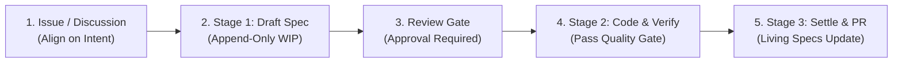
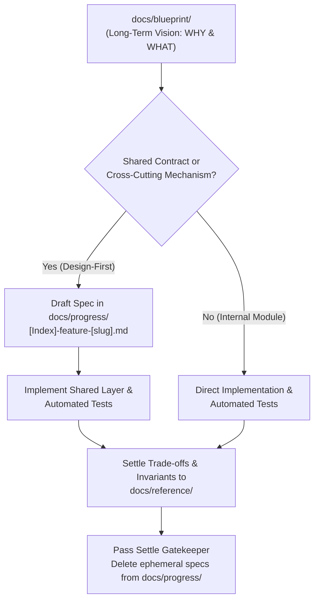
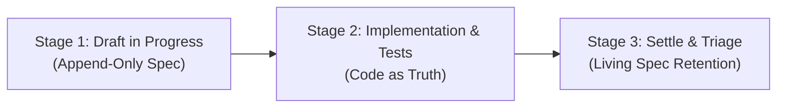

# Contributing to josudoey/skills

Welcome to `josudoey/skills`! We are thrilled that you are interested in contributing to this collection of AI coding agent skills.

This repository adheres to an enterprise-grade **Blueprint-Driven Development (BDD)** engineering workflow. Whether you are a human open-source contributor or an autonomous AI agent, this document serves as the canonical governance engine and operational contract for contributing changes.

---

## 1. Quick Contribution Flow (The 5-Step Cycle)

All contributions follow a disciplined, five-step lifecycle ensuring continuous traceability and zero architecture drift:

- **Step 1: Discussion / Alignment**:
  - Open a GitHub issue or discussion to align on intent, problem scope, and target architecture before writing code.
- **Step 2: Stage 1 Specification**:
  - Draft an active vertical slice specification in `docs/progress/[blueprint-code]/[Index]-feature-[slug].md` (e.g., `docs/progress/1.1/1-feature-example.md`).
- **Step 3: Specification Review Gate**:
  - Implementation is strictly prohibited until the specification is reviewed and approved by repository maintainers.
- **Step 4: Stage 2 Implementation & Automated Verification**:
  - Implement skills, schemas, or tool configs alongside automated tests. Run `audit-workflow-fitness` to verify zero regression.
- **Step 5: Stage 3 Settle Protocol & Pull Request**:
  - Settle enduring invariants and code maps into `docs/reference/`, clean up ephemeral WIP specs according to the Settle Gatekeeper, and submit a pull request.

---

## 2. Documentation Architecture (Path-as-Status)

To maximize engineering velocity and eliminate manual tracking friction, this repository organizes documentation using a PARA-inspired structure:

1. **Product Blueprint ➔ `docs/blueprint/` (Vision & Intent)**:
   - **Purpose**: Captures long-term product vision, user personas, desired end-to-end flows, and business goals (WHY & WHAT).
   - **Retention Policy**: Serves as a frozen architectural design archive. **Never retroactively modify blueprints for tactical implementation trade-offs**. The blueprint permanently anchors original intent.
   - **Boundary Guardrail (Capability vs Tactical Leakage)**: Blueprints declare enduring business and system capabilities. **Tactical implementation details (concrete rule IDs, function signatures, CLI flags, token budgets, or test assertions) are strictly prohibited** in blueprints; these belong solely to active specifications (`docs/progress/[blueprint-code]/`).
2. **Active Project Specifications ➔ `docs/progress/[blueprint-code]/` (WIP Deltas)**:
   - **Purpose**: Active, scoped implementation plans detailing module interactions, data flows, and schema deltas for the specific blueprint capability (e.g., `docs/progress/1.1/1-feature-example.md`).
   - **Path-as-Status**: A document's presence inside `docs/progress/` signifies it is pending or actively in development. **Explicit status fields (e.g., Draft / Approved / In Progress) are strictly prohibited** in document headers.
   - **Spec Immutability & Append-Only Rule**:
     - Completed specifications with passing automated tests represent delivered historical facts. **Retroactive modification is strictly prohibited**.
     - Requirements evolutions must be created as new specifications with the next incremented index (e.g., `[NextIndex]-feature-[slug].md`), documenting only the net delta.
3. **Living Domain Realities & Architectural Trade-offs ➔ `docs/reference/` (Living Specs)**:
   - **Purpose**: The enduring single source of truth for current production reality—capturing core business invariants, blueprint trade-offs, and living code navigation maps.
   - **Strict Rule: No Duplicate Field Lists (Code as Truth)**:
     - `docs/reference/` **never duplicates PRDs or field dictionaries**.
     - Implementation details (API payloads, schema fields, status codes) are verified directly against production schemas, typed contracts, and automated tests.
4. **Project Resources**:
   - Production code, global conventions, configuration, and build toolchains constitute project resources.
5. **Language Invariant (English-Only Maintenance)**:
   - All documentation across `docs/blueprint/`, `docs/progress/`, `docs/reference/`, and `CONTRIBUTING.md` must be authored and maintained exclusively in English.
6. **Agentic Documentation Formatting (Structured Lists over Tables)**:
   - For AI agent cognitive efficiency and repository hygiene, documentation governing rules, behaviors, and constraints must use **hierarchical bulleted lists with bold keys (`- **Key**: ...`)** rather than Markdown tables.
   - *(Exception: Minimal 2–3 column comparative matrices with $\le 5$ rows and short text cells are acceptable for high-level summaries).*

---

## 3. Specification Chain & Invariant Guard

To prevent implementations from deviating from system architecture, all specifications and implementations must adhere to a strict unidirectional dependency chain:

$$\text{Mechanism (Flows \& Sequence)} \longrightarrow \text{Core Schemas / DTOs} \longrightarrow \text{Endpoint Contracts} \longrightarrow \text{Domain State} \longrightarrow \text{Handlers / Repos / UI}$$

### The Three Invariant Rules:
1. **Strict Downstream Inheritance**:
   Downstream specifications (contracts, handlers, UI components) must treat upstream architectural boundaries as immutable hard constraints. Downstream designs must never unilaterally override upstream decisions.
2. **Divergence Escalation**:
   If an upstream contract or mechanism is found flawed during implementation, **never modify downstream code to bypass or silently patch it**. Pause downstream work immediately, raise an upstream revision proposal, and update the upstream contract first.
3. **Ghost Field Gatekeeper (Truth Tracing)**:
   All presentation props, form fields, and client models must trace 100% back to declared domain entities, DTO schemas, or pure formatters. Hallucinating undefined fields in UI mockups or client adapters is strictly prohibited. If a field is missing, propose an upstream schema expansion.

---

## 4. Standard Three-Stage Lifecycle

### Stage 1: Draft in Progress
- **Scope**:
  - **Vertical Slice (Recommended)**: For end-to-end features spanning shared schemas, backend logic, and frontend/CLI presentation, prefer a single slice file: `docs/progress/[blueprint-code]/[Index]-feature-[slug].md` (e.g., `docs/progress/1.1/1-feature-example.md`).
  - **Design-First**: Cross-cutting mechanisms (`mechanism`), shared schemas (`data-type`), or public contracts (`contract`).
  - **Code-Alongside**: Pure internal module handlers or UI components may be implemented directly against the Blueprint without blocking progress specs.
- **Rules**:
  - Name files according to standard conventions without status badges.
  - Check upstream contracts before drafting downstream specs.
  - New revisions always increment the numerical prefix (Append-Only).
  - **Stage 1 Gate (No Premature Implementation)**: The deliverable of Stage 1 is strictly the specification document in `docs/progress/`. Implementation directories, application code, and scripts MUST NOT be created until the specification is reviewed and approved by an engineer.

### Stage 2: Implementation & Verification
- **Rules**:
  - **Unidirectional Navigation**: Implementation code and skills remain clean, pure, and decoupled from internal documentation paths. Traceability is maintained unilaterally in `docs/reference/[domain].md` (Code Navigation Map). Code comments SHOULD NOT maintain reverse pointers (e.g. `// Ref: ...`) back to documentation, preventing redundant maintenance friction and cross-boundary coupling.
  - Implement accompanying automated tests (unit, contract, and integration tests).
  - Run project-level linters and test suites to verify zero regressions.

### Stage 3: Settle, Triage & Retention
Once automated tests pass and acceptance criteria are met, execute the **Settle Protocol**:

1. **Knowledge Settlement**:
   - If the implementation scoped down features relative to the Blueprint, document the rationale under `Blueprint Trade-offs` in `docs/reference/[domain].md`.
   - Record non-negotiable business constraints under `Business Rules & Invariants`.
   - Update file paths in the `Code Map`.
2. **Type-Based Triage**:
   - **Code-Alongside Specs (`ui`, `handler`, `repo`)**: Code and tests are the truth. Verify Code Map is updated, then **delete** the file from `docs/progress/`.
   - **Vertical Slice Specs (`feature`)**: If the spec contains long-term sequence diagrams or domain rules, transfer them to `docs/reference/[domain].md`, then **delete** the progress file.
   - **Architectural Mechanism Specs (`mechanism`)**: **NEVER delete casually**. Architectural mechanisms carry cross-boundary sequences, state machines, and degradation policies. Ensure all Mermaid diagrams and decision rationales are 100% transferred to `docs/reference/` before removing the progress file.
3. **The Settle Gatekeeper (Three-Question Test)**:
   Before executing `git rm` on any progress spec, verify:
   1. *Does this spec contain Mermaid sequence diagrams or state machine flows not immediately obvious from reading the code?*
   2. *Does this spec contain critical fault-tolerance, offline degradation, or quarantine recovery rules?*
   3. *Can a future engineer or AI agent understand this mechanism entirely from the remaining code and Reference documentation?*
   - If the answer to (1) or (2) is "Yes", **prohibit deletion** until the knowledge is fully migrated into a Living Spec.

---

## 5. Code & Commit Hygiene

To maintain a high standard of quality across the repository:

- **Conventional Commits**:
  - Follow the Angular commit convention: `<type>(<scope>): <subject>`
  - Types: `feat`, `fix`, `docs`, `style`, `refactor`, `test`, `chore`.
  - Subject must be in English, imperative mood, lowercase, no trailing period, $\le 100$ characters.
- **Pure-Skill First**:
  - Skill definitions should prioritize pure cognitive instructions (`SKILL.md`) over external runtime dependencies wherever feasible.
- **Unidirectional Code Maps**:
  - Keep source files free of reverse documentation comments. Register all navigation targets directly in `docs/reference/`.
