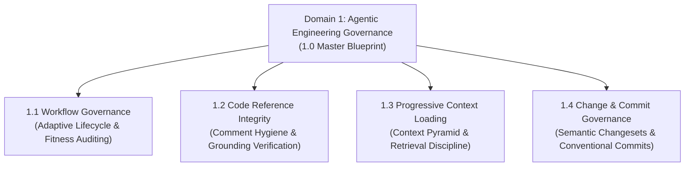

# Agentic Engineering Governance Master Product Blueprint

## 1. Metadata
- **Blueprint Code**: 1.0
- **Date**: 2026-10-08

---

## 2. Overview & Strategic Vision

### 2.1 The AI Agentic Paradigm Shift
In software engineering assisted by autonomous AI agents, traditional static governance and manual developer documentation fail under production scale:
- **Agent Attention Degradation ("Lost in the Middle")**: As context windows expand with hundreds of files, LLMs suffer from severe attention loss on critical rules and instructions embedded within large prompts or bulky markdown files.
- **Context Window Exhaustion & Cognitive Inflation**: Monolithic PRDs, massive type dictionaries, and static rulebooks prematurely consume context capacity, crowding out token budgets needed for code reasoning, test execution, and multi-file planning.
- **Hallucination & Stale Commentary Anchoring**: Agents treat outdated code comments, legacy documentation, and obsolete API dictionaries as authoritative facts, generating code against non-existent APIs or deprecated file paths.
- **Uncontrolled Architectural Drift**: Without deterministic stage gates and automated fitness verification, agent-driven velocity quickly fragments codebases and circumvents architectural boundaries.

### 2.2 Domain Strategic Objective
**Domain 1 (Agentic Engineering Governance)** establishes a universally portable, cognitive lightweight, and non-invasive governance infrastructure designed specifically for AI agent pair programming and autonomous execution across polyglot ecosystems. It aligns developer intent, codebase reality, and lifecycle workflows into a coherent, self-hosting operating model without imposing external runtime dependencies or token-heavy scaffolding.

---

## 3. Core Invariants & Safety Guardrails

All capabilities across Domain 1 must adhere to the following architectural guardrails:

- **Strict Non-Invasive Safety Guardrail**:
  Governance engines and inspection capabilities operate strictly in read-only diagnostic mode on business logic. Governance tools isolate modifications strictly to explicit project governance frameworks and documentation hierarchies, never unilaterally altering application source code, business data, or production runtime assets.
- **Code as Truth (Zero Duplicate Schemas)**:
  Production schemas, typed interfaces, DTOs, and automated tests are the single source of truth. Governance documentation never duplicates API payload tables or database field dictionaries.
- **Repository Self-Hosting Loop**:
  This repository continuously governs and validates its own skills, rules, specifications, and workflows using the very tools it publishes.
- **Unidirectional Navigation Decoupling**:
  Source code and domain capabilities remain pure and decoupled from documentation paths. Code comments must not maintain reverse pointers back to ephemeral working specifications; navigation mapping is maintained unilaterally within living domain reference specifications.
- **Universal Portability & Cognitive Lightweight Invariant**:
  Governance capabilities must remain strictly agnostic to target programming languages, host runtime environments, and specific AI agent toolchains. Capabilities must prioritize zero-dependency, cognitive-first designs over external script runtimes or bulky packages (Pure-Skill First), ensuring 100% universal portability across diverse execution environments while strictly budgeting context overhead through token-guarded inspection and UNIX silence ("Silence is golden").
- **English-Only Maintenance Invariant**:
  All blueprints, specifications, living references, capability definitions, and commit messages must be authored and maintained exclusively in English to eliminate semantic ambiguity and cognitive friction for polyglot AI coding agents.

---

## 4. Domain 1 Capability Landscape (WBS Map)

Domain 1 decomposes agentic software governance into four synergistic capabilities:

- **1.1 Workflow Governance ([1.1_workflow-governance.md](1.1_workflow-governance.md))**:
  - Dynamically synthesizes tailored development workflows (formal Blueprint-Driven Development vs. lightweight agile slicing).
  - Establishes continuous lifecycle governance and binary quality gate evaluation for development workflow fitness.
- **1.2 Code Reference Integrity ([1.2_code-reference-integrity.md](1.2_code-reference-integrity.md))**:
  - Verifies code comments, file paths, and symbol pointers directly against active code reality.
  - Eliminates reverse specification couplings and prevents agent hallucination.
- **1.3 Progressive Context Loading**:
  - Implements hierarchical context retrieval to prevent context window exhaustion.
  - Guides agents to load high-density topological summaries before reading full implementation bodies.
- **1.4 Change & Commit Governance**:
  - Governs staged changesets and automatically synthesizes structured conventional commit records.
  - Ensures clean historical traceability and release automation compliance.

---

## 5. End-to-End Governance Value Stream

```mermaid
flowchart LR
    subgraph Discovery["1. Discovery & Context"]
        V1["Topology & Workflow Profiling\n(Adaptive Governance)"] --> V2["Hierarchical Context Loading\n(Cognitive Budget Optimization)"]
    end

    subgraph Development["2. Grounded Execution & Quality Gate"]
        V2 --> V3["Specification Alignment\n(Bounded Intent & Deliberate Scope)"]
        V3 --> V4["Code & Test Realization\n(Code as Truth)"]
        V4 --> V5["Reference Grounding Verification\n(Comment Hygiene & Decoupling)"]
        V5 --> V6["Workflow Fitness Gate\n(Binary Quality Determination)"]
    end

    subgraph Settlement["3. Knowledge Settle & Release"]
        V6 --> V7["Living Knowledge Settlement\n(Enduring Reality & Invariants)"]
        V7 --> V8["Semantic Change Governance\n(Structured Traceability & Release)"]
    end
```

---

## 6. Functional Scope

### P0 (Core System Capabilities)
- **Unified Governance Architecture**: Canonical baseline defining invariant guardrails, code-as-truth, and self-hosting validation across all engineering workflows.
- **Universal Portability & Lightweight Execution**: Zero-dependency cognitive design ensuring instant cross-platform execution without host runtime prerequisites or context bloat.
- **Symmetric Architecture Mapping**: Harmonized parity and bidirectional traceability between overarching intent, active specification deltas, and living domain reality.

### P1 (Advanced Governance Capabilities)
- **Multi-Agent Coordination Contracts**: Standardized collaboration and handoff protocols between specialized autonomous agents (planner, implementer, and quality auditor).
- **Automated Living Knowledge Settlement**: Intelligent extraction and synchronization of realized business rules, state machines, and architectural trade-offs from verified changes into enduring living specifications.
