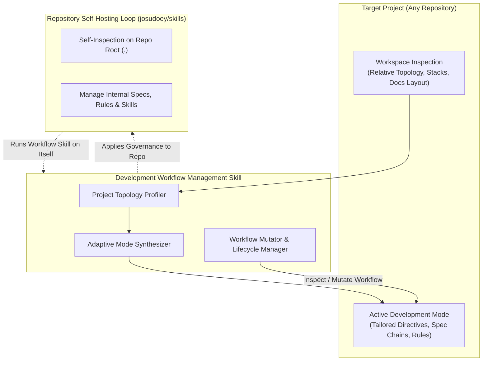
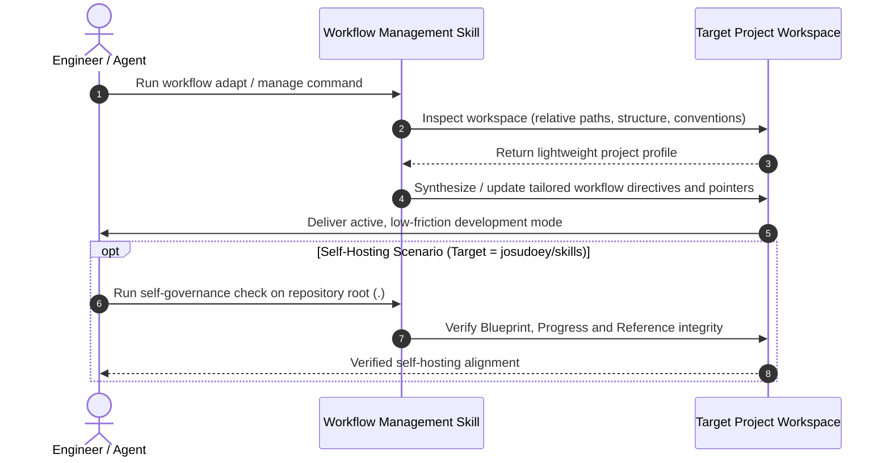

# Adaptive Development Workflow Management Product Blueprint

## 1. Metadata
- **Blueprint Code**: 1.1
- **Target Applications / Modules**: Workflow Management Skills (`skills/`), Repository Governance (`docs/`, `.agents/`)
- **Date**: 2026-10-06

---

## 2. Overview & Problem Statement

### 2.1 Problem
In agentic AI-assisted software development, engineering workflows frequently break down due to rigid, static governance:
1. **Inability to Adapt to Diverse Projects**:
   Traditional workflow templates (such as monolithic agile rules or fixed BDD conventions) are static. Imposing heavy enterprise specifications on lightweight utilities causes severe token inflation and agent confusion ("Lost in the Middle"); conversely, running complex multi-module systems with minimal guidelines leads to architectural drift and uncoordinated implementations.
2. **Lack of Standardized Workflow Modification & Evolution**:
   Once a development process is introduced, teams and agents lack standardized, portable tools to inspect, tune, or mutate the workflow as the project matures. Workflow governance remains manual, inconsistent, and difficult to manage.
3. **Absence of Self-Hosting Governance in this Repository**:
   This repository (`josudoey/skills`) creates workflow and developer capability tools, yet historically lacks a programmatic way to use its own workflow capabilities to manage, evolve, and verify itself (Self-Hosting Gap).

### 2.2 Solution
Build a standardized, portable **Development Workflow Management Skill** capable of:
- **Adaptive Mode Generation**: Automatically analyzing any target project workspace to establish a project-tailored development mode (e.g., formal Blueprint-Driven Development with specification chains for complex systems vs. streamlined agile slicing for smaller repos).
- **Workflow Management & Mutation**: Providing programmatic operations to manage, inspect, tune, and evolve the active development workflow and conventions throughout the project lifecycle.
- **Repository Self-Hosting**: Applying this workflow management capability directly to **this repository itself** (`josudoey/skills`), ensuring that all subsequent capabilities, blueprints, and skills within this repo are governed, updated, and validated through its own workflow engine.

### 2.3 Non-Invasive Architectural Guardrail
> [!IMPORTANT]
> **Strict Non-Invasive Principle**:
> The workflow management skill operates exclusively on repository governance artifacts and documentation hierarchies. It **never** mutates business source code, data stores, or application logic during workflow adaptation or mutation.

---

## 3. Personas & Scenarios

- **Autonomous AI Coding Agent**:
  - *Context*: Operating in any arbitrary target repository.
  - *Scenario*: Invokes the workflow skill to detect the project context and dynamically mount the optimal development mode (rules, spec chains, and constraints) before writing code.
- **Repository Developer / Maintainer**:
  - *Context*: Managing either an external target project or this skills repository itself.
  - *Scenario*: Uses the workflow management skill to inspect governance fitness, adjust development rules, or self-host the creation and validation of new skills.

---

## 4. Architectural Value Stream & Flows

### 4.1 Value Stream Architecture

### 4.2 Sequence Interaction

---

## 5. Capability-Level Functional Scope

### P0 (MVP / Required Capabilities & Self-Hosting)

1. **Project Topology Profiling Capability**:
   - Inspects target workspaces using relative paths to detect languages, frameworks, package managers, and documentation structures.
   - Generates a normalized, high-density project topology fingerprint designed to prevent context window inflation and agent attention degradation.
   - Accurately classifies distinct repository topologies and specialized governance archetypes (e.g., standard applications, multi-package libraries, and agent skill repositories).

2. **Adaptive Mode Synthesis Capability**:
   - Maps project fingerprints to appropriate development workflow recipes.
   - Dynamically produces or adapts project directives, contextual rule sets, and lightweight workflow pointers.
   - Distinguishes between **Rigorous BDD Mode** (spec-heavy, formal contracts) and **Lightweight Agile Mode** (code-alongside, lean specifications).

3. **Workflow Management & Mutation Capability**:
   - Standardized operations to inspect, update, and evolve active workflow configurations as project needs shift.
   - Operates through decoupled interfaces ensuring cross-platform workflow portability.

4. **Repository Self-Hosting Loop**:
   - Executes workflow management capabilities directly against this repository itself.
   - Continuously governs and validates this repository's living specification lifecycle and governance conventions through its own workflow engine.

### P1 (Enhancements)

- **Continuous Workflow Drift Detection**:
  - Detects when a project's size or complexity outgrows its current workflow mode, proactively recommending governance upgrades.
