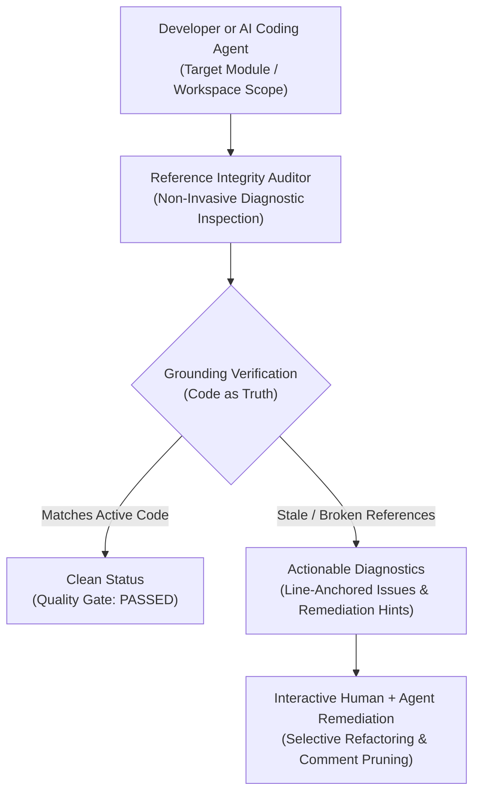

# Code Reference Integrity & Comment Hygiene Product Blueprint

## 1. Metadata
- **Blueprint Code**: 1.2
- **Date**: 2026-10-08

---

## 2. Overview & Problem Statement

### 2.1 Problem
During continuous software evolution, refactoring, and file reorganization, internal pointers embedded inside code comments (file paths, symbol names, and specification links) rapidly decay into stale references:
1. **Dead File & Path Indicators**: Comments reference moved or deleted files, sending engineers and AI coding agents down non-existent paths.
2. **Dead Symbol References**: Comments mention renamed or removed classes, interfaces, or functions, introducing cognitive friction and false mental models.
3. **Reverse Specification Coupling**: Code comments embed pointers back to ephemeral lifecycle documents, creating brittle dependencies and violating unidirectional navigation conventions.
4. **Agent Attention Degradation & Hallucination**: AI coding agents reading code perceive stale commentary as authoritative ground truth, leading to hallucinated dependencies and wasted exploration cycles.

### 2.2 Solution
Establish a standardized, non-invasive **Code Reference Integrity Inspection Capability** that:
- **Grounds References in Code as Truth**: Verifies commentary references directly against the active workspace topology and symbol declarations.
- **Enforces Architectural Decoupling**: Identifies and flags reverse pointers from source code to ephemeral progress artifacts.
- **Emits Actionable Diagnostics**: Produces clear, location-anchored problem summaries and binary quality gate signals.
- **Preserves Separation of Concerns**: Operates strictly in read-only diagnostic mode, leaving code modifications entirely to interactive engineer-agent collaboration.

### 2.3 Non-Invasive Architectural Guardrail
> [!IMPORTANT]
> **Strict Read-Only Non-Invasive Principle**:
> The reference integrity inspection capability operates exclusively as a diagnostic auditor. It **never** writes, modifies, or deletes code or documentation files. All remediations are delegated to interactive execution following engineer review.

---

## 3. Personas & Scenarios

- **Autonomous AI Coding Agent**:
  - *Context*: Onboarding into an unfamiliar or legacy module prior to refactoring.
  - *Scenario*: Uses the reference integrity auditor to verify whether commentary pointers are reliable before planning edits, avoiding hallucinated imports.
- **Code Reviewer / Software Engineer**:
  - *Context*: Conducting pre-merge reviews or sprint hygiene checks.
  - *Scenario*: Audits comment health across touched modules, catching decayed pointers and reverse documentation couplings before settling changes.

---

## 4. User Journey & Architectural Flow

---

## 5. Capability-Level Functional Scope

### P0 (MVP / Required Capabilities)

1. **Reference Extraction Capability**:
   - Filter and parse commentary across common programming languages to extract reference candidates without reading entire files end-to-end.
2. **Grounding Verification Capability**:
   - Resolve target file paths and symbols directly against active workspace assets, verifying physical existence and symbol availability.
3. **Decoupled Architecture Guard**:
   - Detect and flag reverse coupling from implementation code back to ephemeral progress specifications.
4. **Actionable Diagnostic Reporting**:
   - Provide precise location-anchored problem summaries, severity indications, and binary quality gate determination (`PASSED` vs `BLOCKED`).

### P1 (Enhancements)

- **Scoped Changeset Auditing**:
  - Restrict reference inspection exclusively to touched hunks within active Git changesets or branches.
- **Historical Migration Inference**:
  - Infer replacement paths or renamed symbols by inspecting repository commit history for deleted identifiers.
