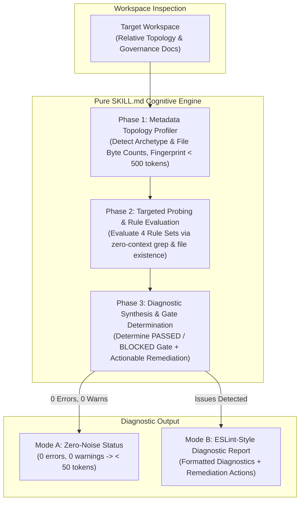

# Feature Specification: Audit Workflow Fitness (`audit-workflow-fitness`)

<!-- Ref: [Blueprint 1.1] §2, §4, §5 (Adaptive Development Workflow Management) -->

## 1. Context & Objectives

This specification defines the vertical slice for the **`audit-workflow-fitness`** skill as a **Pure `SKILL.md`** diagnostic workflow, directly anchoring to [Blueprint 1.1: Adaptive Development Workflow Management](../../blueprint/1.1_adaptive-skill-bootstrap.md).

It implements the diagnostic, inspection, and fitness evaluation capability required to ensure that development workflows (`dev-workflow.md`, `docs/reference/`, `docs/convention/`, `.agents/rules/`, `AGENTS.md`) actively support the delivery pipeline (**Blueprint $\rightarrow$ Progress $\rightarrow$ Code**) without generating cognitive overload, token inflation, or governance drift.

Operating as an **"Lint for Development Workflow & Markdown Governance"**, this skill departs from arbitrary 100-point composite scoring models to eliminate the compensatory fallacy (where high scores in unrelated areas obscure critical navigation failures). Instead, it classifies findings into actionable **`error` (blocker)** and **`warn` (advisory smell)** diagnostics with a strict **Quality Gate (`PASSED` vs `BLOCKED`)**.

Adopting a **Pure `SKILL.md` (Zero-Script / Zero-Runtime)** architecture, this skill achieves universal portability across any operating environment (regardless of Node.js or Python availability) and leverages the AI Agent's semantic understanding to avoid rigid, false-positive-heavy regex checks while strictly preventing token blow-up through a metadata-first inspection protocol and UNIX silence ("Silence is golden").

---

## 2. Core Capabilities & Architecture



### 2.1 Token-Guarded Inspection Protocol (Strict Constraint)

To prevent the AI Agent from consuming tens of thousands of tokens by indiscriminately dumping full documents into its context window, `audit-workflow-fitness` enforces a strict **Metadata-First Protocol**:

1. **Never read full convention/reference files upfront**: File token weights must be estimated from directory listing byte counts (`bytes / 3.8` for ASCII; `bytes / 2.0` for CJK / multi-byte UTF-8) obtained via `list_dir` or `ls -lh`.
2. **Targeted probing**: Search for broken relative links, invalid Code Map references, and governance anti-patterns (e.g., prohibited manual lifecycle status headers, redundant schema dictionaries) using zero-context pattern searching (`grep_search` / `grep` / `test -e`) without viewing full file bodies.
3. **Selective slice reading**: If a violation or broken link is suspected, view only the relevant line range (`StartLine` / `EndLine`) rather than loading entire files.
4. **Context Budget**: The complete audit workflow should consume $< 2,000$ tokens of context overhead.

### 2.2 Capability 1: Project Topology Profiler (Ref: Blueprint 1.1 §5.1)

- **Objective**: Inspect the target workspace to generate a normalized, lightweight project fingerprint strictly constrained to $< 500$ tokens.
- **Archetype Classification**:
  - `skills-repository`: Identified by the presence of a top-level `skills/` directory containing `*/SKILL.md` files.
  - `monorepo`: Identified by `pnpm-workspace.yaml`, `nx.json`, `lerna.json`, or sub-packages structure.
  - `application`: Identified by standard package configurations (`package.json`, `Cargo.toml`, `go.mod`, etc.) without workspace files.
- **Topology Metadata**: Counts governance artifacts (`docs/blueprint/`, `docs/progress/`, `docs/reference/`, `docs/convention/`, `.agents/rules/`, `AGENTS.md`) and estimates token footprints from file sizes.

### 2.3 Capability 2: 4-Dimensional Diagnostic Rule Engine (Ref: Blueprint 1.1 §5.3)

Rather than computing arbitrary numeric point deductions, the audit engine categorizes all workflow checks into **4 Rule Sets** with two strict severity levels:

- 🔴 **`error` (Blocker)**: Critical failures that break agent navigation, cause runtime tool-call crashes, or violate core lifecycle invariants. **Any `error` immediately blocks the Quality Gate.**
- 🟡 **`warn` (Advisory Smell)**: High token friction, documentation bloat, or anti-patterns that degrade agent context without completely breaking execution. **Warnings do not block the gate.**

$$\text{Quality Gate} = \begin{cases} \mathbf{PASSED}, & \text{if } \text{errors} = 0 \\ \mathbf{BLOCKED}, & \text{if } \text{errors} > 0 \end{cases}$$

---

#### Rule Set 1: `consistency` (Governance Consistency & Anti-Pattern Rules)

- **`consistency/no-manual-status-header` (`error`)**:
  - Scans `docs/progress/**` for prohibited manual lifecycle status fields (`Status: Draft`, `Status: In Progress`, etc.).
  - Lifecycle status must be strictly inferred from the directory path (Path-as-Status).
- **`consistency/no-broken-relative-links` (`error`)**:
  - Scans markdown links inside `docs/` and `AGENTS.md` targeting local workspace files using relative paths.
  - Every referenced relative path must resolve to an existing file or directory.

#### Rule Set 2: `friction` (Cognitive & Token Friction Rules)

- **`friction/max-token-overhead` (`warn`)**:
  - Estimates token counts across all rule and convention files (`docs/convention/**`, `.agents/rules/**`, `AGENTS.md`).
  - Triggers a warning if any individual convention file exceeds ~3,000 tokens ($\approx \text{bytes} / 3.8$ for ASCII, $\text{bytes} / 2.0$ for CJK).
  - Flags files $> 6,000$ tokens as high-friction monolithic files requiring decomposition.
- **`friction/no-bloated-schema-tables` (`warn`)**:
  - Inspects markdown convention files for prohibited bloated schema/field tables (tables containing $> 8$ rows of type/field DTO definitions, rather than concise architectural comparison tables).

#### Rule Set 3: `truth` (Code-as-Truth Purity Rules)

- **`truth/no-duplicate-api-dictionaries` (`warn`)**:
  - Verifies that living specifications in `docs/reference/` do not duplicate API payload tables or database schema dictionaries.
  - Ensures reference files focus strictly on business invariants, trade-offs, state machines (Mermaid), and Code Maps, delegating data structures to production code contracts.

#### Rule Set 4: `traceability` (Traceability & Lifecycle Alignment Rules)

- **`traceability/valid-codemap-paths` (`error`)**:
  - Validates that paths referenced in `docs/reference/*.md` Code Navigation Maps exist in the codebase.
  - Prevents agent hallucination and navigation failure caused by stale code pointers.
- **`traceability/valid-blueprint-mapping` (`error`)**:
  - Validates that active slice directories under `docs/progress/[code]/` correspond to a valid blueprint code in `docs/blueprint/`.
  - For `skills-repository` archetypes, verifies adherence to `.agents/rules/skills-repository.md` (e.g., standard skill directory structure and relative catalog links).

### 2.4 Non-Invasive Architectural Guardrail (Ref: Blueprint 1.1 §2.3)

- The audit engine operates in **read-only mode**.
- It strictly inspects repository governance artifacts (`AGENTS.md`, `.agents/`, `docs/`) and **never** modifies or mutates application source code.
- Interactive remediation suggestions are presented in the diagnostic output for developer approval.

---

## 3. Standard Diagnostic Output Schema

### 3.1 Mode A: Clean Run (UNIX Silence / Zero Noise)

When no errors or warnings are found, the skill outputs a minimal status to maximize token preservation:

```text
✔ Checked 14 governance files across 4 dimensions.
✨ 0 errors, 0 warnings. Quality Gate: PASSED (Archetype: skills-repository).
```

### 3.2 Mode B: Issues Detected (ESLint-Style Diagnostic Report)

When diagnostics are present, findings are reported with exact locations, rule IDs, severities, and actionable remediation:

```text
docs/progress/1.1/1-feature.md:4
  [consistency/no-manual-status-header] Found prohibited 'Status: Draft'. Infer status from directory path. (error)

docs/reference/overview.md:42
  [traceability/valid-codemap-paths] Referenced path 'src/missing-router.ts' does not exist. (error)

docs/convention/api.md
  [friction/max-token-overhead] File is ~4,200 tokens (threshold: 3,000). Consider splitting into modular topics. (warn)

✖ 3 problems (2 errors, 1 warning)
Quality Gate: BLOCKED (Resolve 2 errors to pass)

🛠️ Recommended Action Items:
1. Remove line 4 ('Status: Draft') in docs/progress/1.1/1-feature.md.
2. Update Code Map link in docs/reference/overview.md:42 to point to valid source file.
3. Split docs/convention/api.md into focused sub-rules under docs/convention/.
```

### 3.3 Mode C: Structured JSON Output (Machine Readable)

When requested with JSON output, the Agent produces:

```json
{
  "gate": "BLOCKED",
  "archetype": "skills-repository",
  "summary": {
    "filesChecked": 14,
    "errors": 2,
    "warnings": 1
  },
  "diagnostics": [
    {
      "rule": "consistency/no-manual-status-header",
      "severity": "error",
      "file": "docs/progress/1.1/1-feature.md",
      "line": 4,
      "message": "Found prohibited 'Status: Draft'. Infer status from directory path.",
      "suggestedFix": "Remove line 4."
    },
    {
      "rule": "traceability/valid-codemap-paths",
      "severity": "error",
      "file": "docs/reference/overview.md",
      "line": 42,
      "message": "Referenced path 'src/missing-router.ts' does not exist.",
      "suggestedFix": "Update link to valid path."
    },
    {
      "rule": "friction/max-token-overhead",
      "severity": "warn",
      "file": "docs/convention/api.md",
      "line": null,
      "message": "File is ~4,200 tokens (threshold: 3,000).",
      "suggestedFix": "Split into modular topics."
    }
  ]
}
```

---

## 4. Planned Implementation Slice (For Stage 2 Execution)

1. **Pure Skill Definition**: `skills/audit-workflow-fitness/SKILL.md`
   - YAML frontmatter: `name: audit-workflow-fitness`, `description`.
   - Token-Guarded Inspection Protocol instructions with CJK-aware byte sizing.
   - Step-by-step cognitive evaluation workflow:
     - Phase 1: Topology Profiling (< 500 tokens).
     - Phase 2: Targeted Probing across the 4 rule sets (`consistency`, `friction`, `truth`, `traceability`).
     - Phase 3: Diagnostic Synthesis & Gate Determination (`PASSED` vs `BLOCKED`).
   - Actionable interactive remediation guidelines.
2. **Repository Registration**: `README.md`
   - Updated skill catalog formatted as a bulleted list with relative link (`- **[audit-workflow-fitness](./skills/audit-workflow-fitness)**: ...`).

_(Note: Zero auxiliary scripts in `scripts/`; zero runtime dependencies)._

---

## 5. Verification & Acceptance Gates (Ref: Blueprint 1.1 §6)

1. **Repository Self-Hosting Gate**:
   - Agent activates `audit-workflow-fitness` on `.` (`josudoey/skills`).
   - Accurately classifies workspace as `skills-repository`, validates Blueprint 1.1 mapping to `docs/progress/1.1/`, and confirms **Quality Gate: PASSED (0 errors)**.
2. **Token Economy Gate**:
   - The inspection workflow strictly follows the Metadata-First protocol without dumping full files into context, consuming $< 2,000$ tokens of context overhead during audit execution.
3. **Non-Invasive Safety Gate**:
   - The audit produces zero filesystem mutations on application code.
4. **Target Workspace Adaptation Gate**:
   - Auditing an external workspace (e.g., `omni-pos`) classifies it as `monorepo`, evaluates rule sets without reading full file bodies, and flags warnings for files $> 3,000$ tokens.
5. **Skill Ecosystem Discovery**:
   - `npx skills add . -l` cleanly discovers `audit-workflow-fitness`.
