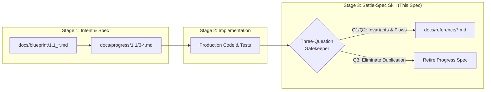
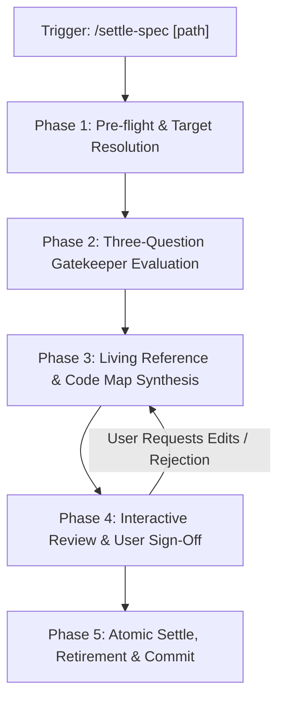

# Feature Specification: Settle Specification Skill (`3-feature-settle-spec-skill`)

<!-- Ref: [Blueprint 1.1] §2, §4, §5 (Workflow Governance) -->

## 1. Overview & Rationale

This specification defines the vertical slice for the **`settle-spec`** skill as a **Pure `SKILL.md`** cognitive workflow, directly anchoring to [Blueprint 1.1: Workflow Governance](../../blueprint/1.1_workflow-governance.md) within [Domain 1: Agentic Engineering Governance](../../blueprint/1.0_agentic-engineering-governance.md).

It formalizes and automates **Stage 3: Specification Settlement** of the Blueprint-Driven Development (BDD) lifecycle, enforcing the **Three-Question Settle Gatekeeper**, extracting enduring living architecture and invariants to `docs/reference/`, maintaining accurate Code Navigation Maps, and safely retiring verified progress specifications.



### 1.1 Context & Problem Statement
In AI-assisted software development, teams and autonomous agents routinely face three breakdown patterns when concluding feature delivery:
1. **Knowledge Evaporation**: When a feature is completed, agents or developers often delete the active progress specification outright without preserving non-obvious state machines, fault-tolerance flows, or recovery rules. Future engineers and AI agents are left to reverse-engineer these implicit boundaries from disparate code files.
2. **Zombie WIP Spec Accumulation**: Conversely, completed specifications frequently linger indefinitely inside `docs/progress/`, obscuring true repository work-in-progress status and violating the **Path-as-Status** governance standard.
3. **Compensatory DTO Duplication (Code-as-Truth Erosion)**: When manually attempting to create reference documentation, agents frequently copy-paste API request/response payloads and database schema field tables from progress files into `docs/reference/`. This creates stale duplicate schemas that rot immediately upon the next code refactoring.

### 1.2 Target Objectives
- Provide a standardized, portable slash command `/settle-spec [path]` (or zero-argument interactive mode) that executes the Settle Gatekeeper protocol.
- Automatically evaluate the **Three-Question Test** to determine what architectural knowledge warrants permanent retention in `docs/reference/`.
- Synthesize living reference updates and Code Navigation Maps without duplicating code-level DTOs or schema tables (**Code as Truth**).
- Require explicit human confirmation through an interactive diff preview before mutating any documentation or deleting progress files.
- Automatically retire the target progress file and cleanly prune empty parent directories upon approval.

---

## 2. System Invariants & Guardrails

All operations within the `settle-spec` skill must strictly adhere to the following invariants:

### 2.1 Non-Invasive Safety Guardrail
- The `settle-spec` engine operates exclusively on repository governance artifacts (`docs/progress/` and `docs/reference/`).
- It **never** mutates, touches, or deletes application source code, business data, or automated test files during settlement.

### 2.2 The Three-Question Settle Gatekeeper Invariant
Before any active specification in `docs/progress/` is retired, the cognitive engine must evaluate and document:
1. **Q1 (Architectural & State Flows)**: *Does this specification contain Mermaid sequence diagrams, state machine flows, or cross-system protocol transitions not immediately obvious from reading raw code?*
   - If **YES**: Extract and synthesize into `docs/reference/[domain].md`.
2. **Q2 (Fault-Tolerance & Boundary Rules)**: *Does this specification define critical fault-tolerance, offline degradation, retry compensation, quarantine recovery, or domain boundary invariants?*
   - If **YES**: Extract and synthesize into `docs/reference/[domain].md`.
3. **Q3 (Code-as-Truth & Self-Explanatory Logic)**: *Can a future engineer or AI agent understand this mechanism entirely from the production code and automated tests?*
   - If **YES**: **Discard ephemeral details**. Explicitly exclude standard API route tables, CRUD DTO field lists, and mock payloads. Production code is the single source of truth.

### 2.3 Interactive Human Confirmation Guardrail
- The skill must **never** execute silent disk mutations.
- The proposed additions to `docs/reference/[domain].md` and the list of files targeted for deletion must be presented in a clean, human-readable review preview before applying changes.

### 2.4 Pure-Skill First (Zero-Runtime Dependency)
- Implemented strictly as a pure markdown cognitive workflow (`SKILL.md`), executable in any environment without requiring host-specific runtimes (such as Node.js or Python).
- Uses standard LLM semantic reasoning and native platform file tools (`list_dir`, `view_file`, `replace_file_content`, `run_command`).

### 2.5 English-Only Maintenance Invariant
- All synthesized reference documents, section headers, code map pointers, and git commit messages must be authored and maintained exclusively in English.

---

## 3. Five-Phase Cognitive Execution Protocol



### Phase 1: Pre-flight Verification & Target Resolution
1. **Target Specification Resolution**:
   - If the user provides a path (e.g., `/settle-spec docs/progress/1.1/3-feature-*.md`), verify that the target file exists.
   - If no argument is provided, inspect `docs/progress/` (excluding `README.md`) and present an enumerated list of candidate in-flight specifications for the user to select.
2. **Verification of Completion Proof**:
   - Verify that implementation code and automated tests corresponding to the specification exist in the repository.
   - Check Git status to ensure the working tree does not have uncommitted, conflicting WIP in target areas.

### Phase 2: Three-Question Gatekeeper Evaluation
1. Read the target specification using bounded line-range inspection.
2. Formulate explicit answers for Q1, Q2, and Q3:
   - Itemize candidate diagrams, invariants, and fallback mechanisms for migration.
   - Filter out ephemeral implementation details, temporary checklists, and duplicated schema definitions.
3. Formulate the **Settlement Triage Decision**:
   - Target living reference destination: `docs/reference/[domain].md` (mapped from the Blueprint domain).

### Phase 3: Living Reference & Code Map Synthesis
1. Locate or initialize the target `docs/reference/[domain].md`.
2. Prepare synthesis sections:
   - **System Invariants & Boundary Rules**: Consolidate findings from Q2.
   - **State Machines & Sequence Flows**: Consolidate Mermaid diagrams from Q1.
   - **Code Navigation Map (Code Map)**: Extract canonical pointers to production interfaces, handlers, and automated test suites implemented in Stage 2.
3. Verify that the synthesized content introduces zero duplicated field dictionaries or schema tables.

### Phase 4: Interactive Review & Human Sign-off
1. Present the **Settle Gatekeeper Review Card**:
   - Three-Question Evaluation summary.
   - Exact Markdown Diff / Preview proposed for `docs/reference/[domain].md`.
   - Explicit list of files and empty directories scheduled for deletion.
2. Request explicit user confirmation (`Proceed` / `Edit` / `Abort`).

### Phase 5: Atomic Settle, Retirement & Commit Suggestion
1. Upon user confirmation:
   - Apply edits to `docs/reference/[domain].md` using standard file replacement tools.
   - Delete the verified progress specification file from `docs/progress/`.
   - Check if the parent slice directory under `docs/progress/` is now empty (or contains only empty subfolders); if so, remove the directory to maintain a clean repository layout.
2. Provide a standard Conventional Commit suggestion:
   ```bash
   git add docs/reference/ docs/progress/
   git commit -m "docs(workflow): settle [feature-name] into living reference"
   ```

---

## 4. File Mutation Matrix (Stage 2 Target Scope)

```text
/Users/joey/dev/skills/
├── skills/
│   └── settle-spec/
│       ├── SKILL.md                                         <-- [NEW] Core Pure-Skill cognitive protocol
│       └── references/
│           ├── settle-checklist.md                          <-- [NEW] Three-Question evaluation guide
│           └── code-map-patterns.md                         <-- [NEW] Code Map pointer design rules
├── docs/
│   ├── progress/
│   │   └── 1.1/
│   │       └── 3-feature-settle-spec-skill.md               <-- [NEW] This specification file
│   └── reference/
│       └── workflow-governance.md                           <-- [MODIFY] Update Code Map & invariants
└── README.md                                                <-- [MODIFY] Catalog settle-spec skill
```

---

## 5. Interface Contract & Output Formats

### 5.1 Interactive Review Format (Phase 4)

```markdown
### 🧹 Settle Gatekeeper Report: `docs/progress/1.2/1-feature-example.md`

#### 1. Three-Question Evaluation
- [x] **Q1 (State Machines & Flows)**: Found 1 Mermaid sequence diagram detailing multi-party auth fallback. (Preserved)
- [x] **Q2 (Fault-Tolerance & Invariants)**: Found invariant: "Tokens expire after 15m; offline tokens quarantined". (Preserved)
- [ ] **Q3 (Self-Explanatory Logic)**: DTO schemas and HTTP status tables are fully codified in `types/auth.ts`. (Excluded)

#### 2. Target Reference Updates
- **Destination**: `docs/reference/auth.md`
- **Proposed Additions**:
  - `## 3. Token Expiration & Quarantine Invariant`
  - `## 4. Multi-Party Authentication Sequence`
  - `## 5. Code Navigation Map` (Added `libs/auth/token-manager.ts`, `tests/auth.test.ts`)

#### 3. Planned Cleanups
- **Delete**: `docs/progress/1.2/1-feature-example.md`
- **Prune**: Directory `docs/progress/1.2/` (empty after deletion)

👉 **Confirm Settlement?** [Proceed / Edit / Abort]
```

### 5.2 Completion Summary Card (Phase 5)

```markdown
### ✨ Specification Settled & Retired

- **Settled Spec**: `docs/progress/1.2/1-feature-example.md`
- **Living Reference Updated**: [`docs/reference/auth.md`](file:///Users/joey/dev/skills/docs/reference/auth.md)
- **Directory Pruned**: `docs/progress/1.2/`
- **Recommended Commit**:
  ```bash
  git add docs/reference/auth.md docs/progress/
  git commit -m "docs(workflow): settle auth example into living spec"
  ```
```

---

## 6. Verification Criteria & Acceptance Tests

1. **Stage Gate Isolation Compliance**:
   - In Stage 1, only this specification file is created. No implementation files (`skills/settle-spec/**`) exist before human approval.
2. **Path & Naming Parity**:
   - The file is located at `docs/progress/1.1/3-feature-settle-spec-skill.md` (no leading zeroes).
   - Complies with PARA and WBS Level 3 specification standards.
3. **Workflow Fitness Audit**:
   - Running `audit-workflow-fitness` must evaluate this specification and report zero `error` diagnostics.
4. **Code-as-Truth & Anti-Duplication Integrity**:
   - The specification explicitly forbids copying raw API tables and DTO definitions into `docs/reference/`.
5. **English-Only Compliance**:
   - The specification contains zero non-English phrases in committed markdown text.
