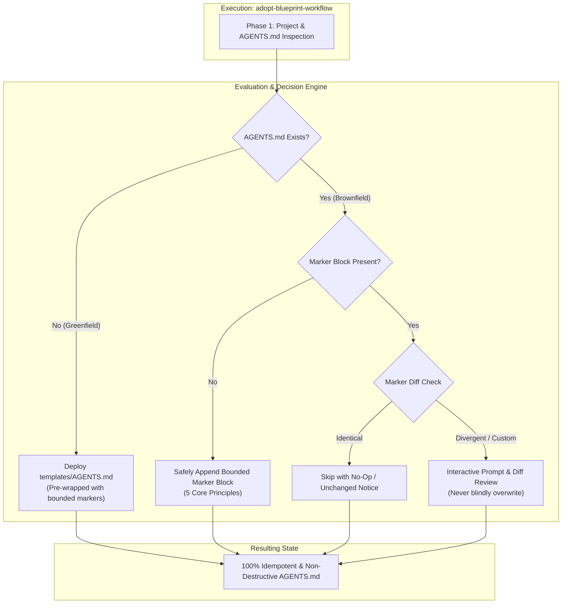

# Feature Specification: Adopt Blueprint Workflow Safety & Directive Alignment (`4-feature-adopt-blueprint-workflow-safety`)

<!-- Ref: [Blueprint 1.1] §2, §4, §5 (Workflow Governance) -->

## 1. Overview & Rationale

This specification defines the vertical slice for enhancing the **`adopt-blueprint-workflow`** skill and its canonical templates, directly anchoring to [Blueprint 1.1: Workflow Governance](../../blueprint/1.1_workflow-governance.md) within [Domain 1: Agentic Engineering Governance](../../blueprint/1.0_agentic-engineering-governance.md).

It addresses governance drift and safety hazards identified in the initial implementation of the `adopt-blueprint-workflow` skill:
1. **Greenfield / Brownfield Template Divergence**: [`skills/adopt-blueprint-workflow/templates/AGENTS.md`](file:///Users/joey/dev/skills/skills/adopt-blueprint-workflow/templates/AGENTS.md) lacks boundary marker comments (`<!-- blueprint-workflow:start -->` ... `<!-- blueprint-workflow:end -->`), causing repositories initialized via Greenfield mode to fail future idempotent Brownfield updates.
2. **Missing `Stage Gate Isolation` in Skill Instruction Snippet**: While mentioned in the standalone template, the Phase 4 Brownfield injection snippet in [`skills/adopt-blueprint-workflow/SKILL.md`](file:///Users/joey/dev/skills/skills/adopt-blueprint-workflow/SKILL.md) completely omitted `Stage Gate Isolation (No Premature Implementation)`. This omitted the primary guardrail that prevents autonomous agents from generating implementation code during Stage 1.
3. **Destructive Replacement Risk on Brownfield Update**: The existing Phase 4 protocol instructs agents to blindly overwrite all content between marker tags. In repositories where project-specific directives (such as English-Only maintenance or custom linter rules) were added inside the marker block, executing `adopt-blueprint-workflow` wipes out those customized policies.



---

## 2. System Invariants & Guardrails

All operations within `adopt-blueprint-workflow` must strictly adhere to the following invariants:

### 2.1 Marker Boundary Parity Invariant
Every instance of generated or deployed `AGENTS.md`—whether initialized via Greenfield deployment or injected via Brownfield adoption—must encapsulate the core BDD governance directives within explicit comment boundaries:
```markdown
<!-- blueprint-workflow:start -->
...
<!-- blueprint-workflow:end -->
```
This guarantees that subsequent runs of `adopt-blueprint-workflow` or automated workflow auditors can deterministically locate, verify, and parse the directive block without regex ambiguity.

### 2.2 Five Non-Negotiable Core Directives Invariant
The standard BDD directive block across all templates and skill instruction snippets must consistently declare the 5 canonical engineering principles:
1. **Workflow & Lifecycle**: Mandatory reference to `CONTRIBUTING.md`.
2. **Stage Gate Isolation (No Premature Implementation)**: Strict separation of Stage 1 (spec drafting) and Stage 2 (code implementation).
3. **Path-as-Status**: Enforcing PARA architecture without manual status header tags.
4. **Code as Truth**: Production schemas, interfaces, and tests serve as single sources of truth.
5. **Spec Immutability & Append-Only**: Specifications are historical records requiring incremented revision indices.

### 2.3 Non-Destructive Update Guardrail (Zero-Accidental-Loss)
- An existing `AGENTS.md` marker block must **never** be silently or unconditionally overwritten.
- When existing content inside the marker diverges from the standard template, the agent must perform a diff comparison and prompt the user before altering directives.
- Project-specific instructions outside the marker block must remain untouched under all conditions.

### 2.4 Separation of Concerns (BDD Core vs Project-Specific Standards)
- Standard BDD directives belong exclusively inside `<!-- blueprint-workflow:start -->` ... `<!-- blueprint-workflow:end -->`.
- Repository-specific conventions (e.g., framework rules, language directives, path aliases) must be maintained outside this marker block (e.g., under a dedicated `## Project Specific Standards` heading).

### 2.5 English-Only Maintenance Invariant
All repository templates, skill definitions, instructions, and commit messages must be authored and maintained exclusively in English.

---

## 3. Protocol & Execution Specification

### 3.1 Updated Phase 4 Protocol (`AGENTS.md` Pointer Configuration)

The execution protocol for Phase 4 in `SKILL.md` is updated as follows:

```markdown
### Phase 4: `AGENTS.md` Pointer Configuration (Non-Destructive)

Configure the root `AGENTS.md` file using the **Two-Tier Pointer Pattern**:

#### Case A: Greenfield (No Existing `AGENTS.md`)
- Copy `templates/AGENTS.md` directly to the project root `AGENTS.md`.
- Ensure the deployed file contains the pre-configured `<!-- blueprint-workflow:start -->` and `<!-- blueprint-workflow:end -->` boundaries.

#### Case B: Brownfield (Existing `AGENTS.md` Found)
- **STRICT NON-DESTRUCTIVE RULE**: Never overwrite pre-existing instructions, build commands, test guidelines, or custom project sections outside the marker.
- Search for the marker block in the existing `AGENTS.md`:
  `<!-- blueprint-workflow:start -->` ... `<!-- blueprint-workflow:end -->`

1. **If the marker block does NOT exist**:
   Safely append the bounded block to the end of `AGENTS.md`:
   ```markdown

   <!-- blueprint-workflow:start -->
   ## Development Workflow & Governance Directives
   - **Workflow & Lifecycle**: Follow the Blueprint-Driven Development workflow defined in [CONTRIBUTING.md](CONTRIBUTING.md). You MUST read it before planning new features or refactoring.
   - **Stage Gate Isolation (No Premature Implementation)**: When tasked with Stage 1 (drafting/updating specs in `docs/progress/`), the ONLY authorized deliverable is the specification document. You MUST NOT create implementation code, scripts, or modify catalogs in the same turn. After writing the spec, you MUST stop tools and await human review before proceeding to Stage 2.
   - **Path-as-Status**: We follow the PARA documentation architecture. Documents in `docs/progress/` represent active WIP; never write manual status tags in file headers.
   - **Code as Truth**: Production schemas, interfaces, DTOs, and automated tests are the single source of truth. Documentation never duplicates field lists or API payload tables.
   - **Spec Immutability & Append-Only**: Delivered specifications are frozen historical records. Never modify completed specs retrospectively; add new revisions with incremented indices (`[NextIndex]-feature-...`).
   <!-- blueprint-workflow:end -->
   ```

2. **If the marker block DOES exist**:
   - Compare the current block content with the canonical 5 core directives above.
   - **If content matches**: Take no action; log that directives are up to date.
   - **If content differs**: Present a side-by-side diff to the user. Prompt whether to update to canonical directives or retain existing customizations. Never overwrite silently.
```

---

## 4. File Mutation Matrix (Stage 2 Target Scope)

```text
/Users/joey/dev/skills/
├── skills/
│   └── adopt-blueprint-workflow/
│       ├── SKILL.md                                         <-- [MODIFY] Update Phase 4 protocol & snippet
│       ├── templates/
│       │   └── AGENTS.md                                    <-- [MODIFY] Add marker bounds & align 5 directives
│       └── references/
│           └── bdd-workflow-guide.md                        <-- [MODIFY] Align pointer documentation
└── docs/
    └── progress/
        └── 1.1/
            └── 4-feature-adopt-blueprint-workflow-safety.md <-- [NEW] This specification file
```

---

## 5. Interface Contract & Template Deltas

### 5.1 Canonical Template Delta: `skills/adopt-blueprint-workflow/templates/AGENTS.md`

```diff
 # Project Directives & Governance
 
-## 1. Core Principles (Non-Negotiable)
+<!-- blueprint-workflow:start -->
+## Development Workflow & Governance Directives
 
-- **Path-as-Status**: We follow the PARA-based documentation architecture. The location of a document defines its lifecycle status. Never write manual status badges (e.g., `Status: Draft / Approved / In Progress`) inside document headers.
+- **Workflow & Lifecycle**: Follow the Blueprint-Driven Development workflow defined in [CONTRIBUTING.md](CONTRIBUTING.md). You MUST read it before planning new features or refactoring.
 - **Stage Gate Isolation (No Premature Implementation)**: When tasked with Stage 1 (drafting/updating specs in `docs/progress/`), the ONLY authorized deliverable is the specification document. Never create implementation code, scripts, or modify catalogs in the same turn. Stop and await human review before proceeding to Stage 2.
-- **Code as Truth**: Production schemas, interfaces, DTOs, and automated tests are the single source of truth for implementation reality. Never maintain duplicate field lists or API payload tables in markdown documentation.
-- **Spec Immutability & Append-Only**: Delivered specifications (where code and tests are verified) are frozen historical facts. Never retrospectively rewrite completed specs. Requirements evolutions must be introduced as append-only revisions (`[NextIndex]-feature-...`).
+- **Path-as-Status**: We follow the PARA documentation architecture. Documents in `docs/progress/` represent active WIP; never write manual status tags in file headers.
+- **Code as Truth**: Production schemas, interfaces, DTOs, and automated tests are the single source of truth. Documentation never duplicates field lists or API payload tables.
+- **Spec Immutability & Append-Only**: Delivered specifications are frozen historical records. Never modify completed specs retrospectively; add new revisions with incremented indices (`[NextIndex]-feature-...`).
+<!-- blueprint-workflow:end -->
 
-## 2. On-Demand Governance Pointers
-
-- **When planning new features, refactoring, or handling tasks**:
-  You MUST read and follow [CONTRIBUTING.md](CONTRIBUTING.md) before writing implementation plans or code.
-- **When organizing modules and dependencies**:
-  Maintain strict unidirectional dependency flow (Shared/Domain Contracts ➔ Application Services ➔ Infrastructure & Presentation). Never introduce circular dependencies.
-- **When testing and verifying**:
-  Always anchor changes with corresponding automated tests (unit, contract, or integration) before declaring work complete.
+## Project Specific Standards
+<!-- Place project-specific standards, build commands, and custom guidelines below this line -->
```

---

## 6. Verification Criteria & Acceptance Tests

1. **Stage Gate Isolation Enforcement**:
   - In Stage 1, ONLY this specification file (`docs/progress/1.1/4-feature-adopt-blueprint-workflow-safety.md`) is created.
   - Zero files in `skills/adopt-blueprint-workflow/` are modified until human approval is recorded.
2. **Template-Marker Parity Verification**:
   - `templates/AGENTS.md` contains exact matching tags `<!-- blueprint-workflow:start -->` and `<!-- blueprint-workflow:end -->`.
   - The 5 Core Principles in `templates/AGENTS.md` and `SKILL.md` are word-for-word identical.
3. **Idempotency Dry-Run**:
   - Greenfield deployment on an empty directory produces an `AGENTS.md` containing the marker block.
   - Subsequent Brownfield run on that same directory detects existing markers with matching content and takes no destructive action.
4. **Custom Directives Protection**:
   - A mock `AGENTS.md` with customized directives inside the marker block triggers diff notification rather than silent overwriting.
   - Directives outside the marker block remain 100% preserved.
5. **English-Only Compliance**:
   - The specification file and all related template updates strictly adhere to the English-only invariant.
