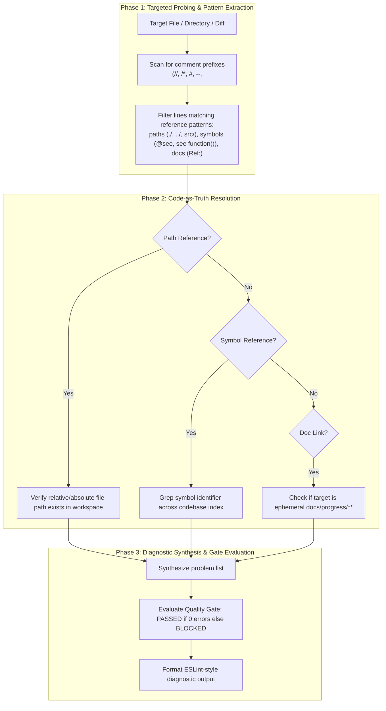

# Stage 1 Specification: Code Reference Integrity Auditor (`audit-stale-ref`)

<!-- Ref: [Blueprint 1.2](../../blueprint/1.2_code-reference-integrity.md) §2, §4, §5 -->

## 1. Overview & Objective

This specification defines the functional contract, cognitive inspection engine, diagnostic rule sets, and delivery criteria for the `audit-stale-ref` skill.

The skill provides a **strictly read-only, token-efficient diagnostic auditor** that inspects internal references in code comments (file paths, symbols, line numbers, and document links) across target codebases, flags stale or rotten pointers, and produces actionable ESLint-style diagnostic reports.

---

## 2. Invariants & Guardrails

### 2.1 Non-Invasive Safety Invariant (Read-Only)
- The skill operates strictly in **read-only mode**.
- Under no circumstances does the skill execute file modification tools (`replace_file_content`, `multi_replace_file_content`, `write_to_file`).
- All code modifications, refactorings, or comment removals are delegated to interactive collaboration between the human engineer and the AI coding agent.

### 2.2 Grounding Invariant (Code as Truth)
- Target file paths, symbol declarations, and exported interfaces in active code constitute the sole authoritative truth.
- A reference is classified as valid **only if** the target entity can be resolved directly in the current workspace.

### 2.3 Unidirectional Navigation Invariant
- Production code and reusable skills must never maintain reverse pointers back to ephemeral lifecycle progress specs (e.g. `docs/progress/**`).
- References to enduring architectural contracts must point exclusively to living references (`docs/reference/**`) or blueprints (`docs/blueprint/**`).

### 2.4 Token Discipline Invariant
- The skill must never perform naive full-file reads across an entire directory.
- Slicing, targeted grep patterns, and comment filtering must constrain the inspection overhead to $< 2,500$ tokens per target module.

---

## 3. Diagnostic Rule Sets

| Rule ID | Severity | Scope | Invariant Requirement |
| :--- | :--- | :--- | :--- |
| `ref/dead-file-path` | 🔴 `error` | Code comments in all source files | All explicit file paths or directory references (e.g. `// see src/utils/tax.ts`, `@see ../types.ts`) must resolve to an existing file in the workspace. |
| `ref/dead-symbol` | 🟡 `warn` | Code comments with symbol markers | Identifiers prefixed with `@see`, `see `, `defined in `, or function references (e.g. `handleCheckout()`) must resolve to a valid symbol declaration in the workspace. |
| `ref/reverse-doc-pointer` | 🟡 `warn` | Code comments in all source files | Code must never contain reverse pointers to active progress specifications (`docs/progress/**`), which are ephemeral and subject to deletion upon settlement. |
| `ref/stale-line-number` | ℹ️ `info` | Code comments with line markers | Comments must not hardcode fragile line numbers (e.g. `// see line 142 in auth.ts`, `auth.ts#L140`). |

### Quality Gate Equation
$$\text{Quality Gate} = \begin{cases} \mathbf{PASSED}, & \text{if } \sum \text{errors} = 0 \\ \mathbf{BLOCKED}, & \text{if } \sum \text{errors} > 0 \end{cases}$$
*(Warnings and Info notices do not block the gate by default, but provide actionable hygiene guidance).*

---

## 4. Cognitive Inspection Engine (3-Phase Protocol)



### Phase 1: Targeted Probing & Pattern Extraction
1. Identify all source code files within the specified target directory (excluding `node_modules`, `.git`, `dist`, `build`, `vendor`).
2. Search for comment lines using language-aware comment markers:
   - C-style / JS / TS / Go / Rust / Java: `//`, `/* ... */`
   - Python / Shell / YAML: `#`
   - SQL / Lua: `--`
   - HTML / Markdown / XML: `<!-- ... -->`
3. Extract candidates containing:
   - Path markers: `/`, `./`, `../`, `.ts`, `.js`, `.py`, `.go`, `.rs`, `.md`
   - Symbol annotations: `@see `, `see [identifier]`, `defined in `, `called by `
   - Specification references: `Ref: `, `RFC-`, `spec: `

### Phase 2: Code-as-Truth Resolution
1. **Path Resolution**:
   - For relative paths (`./`, `../`), resolve relative to the file containing the comment.
   - For project-root paths (`src/...`, `packages/...`), resolve relative to workspace root.
   - If not found $\rightarrow$ trigger `ref/dead-file-path`.
2. **Symbol Resolution**:
   - Strip punctuation/parentheses from target identifiers.
   - Execute targeted grep/symbol check in expected files or global workspace.
   - If identifier not found $\rightarrow$ trigger `ref/dead-symbol`.
3. **Architecture Boundary Check**:
   - If path matches `docs/progress/**` $\rightarrow$ trigger `ref/reverse-doc-pointer`.
4. **Fragility Check**:
   - If comment contains `line \d+` or `#L\d+` $\rightarrow$ trigger `ref/stale-line-number`.

### Phase 3: Diagnostic Synthesis & Reporting
Output results according to the standard reporting formats.

---

## 5. Standard Diagnostic Output Formats

### Mode A: Zero-Noise Status (0 Problems)
```text
✔ Checked [N] references across [M] files in [target-path].
✨ 0 errors, 0 warnings. Quality Gate: PASSED.
```

### Mode B: ESLint-Style Diagnostic Report (Problems Found)
```text
[file]:[line]
  [[rule-id]] [Diagnostic description]. ([severity])
  💡 Comment: `[original comment]`
  💡 Suggestion: [Actionable remediation guidance]

✖ [P] problems ([E] errors, [W] warnings, [I] info)
Quality Gate: [PASSED | BLOCKED] ([Resolution hint])

🛠️ Remediation Guidance:
- To fix errors, instruct your AI coding agent: "Update or remove broken references listed above."
```

### Mode C: Structured JSON Output (When `--json` is requested)
```json
{
  "target": "src/services/billing",
  "filesChecked": 5,
  "referencesScanned": 12,
  "qualityGate": "BLOCKED",
  "summary": {
    "errors": 1,
    "warnings": 1,
    "info": 0
  },
  "diagnostics": [
    {
      "file": "src/services/billing/invoice.ts",
      "line": 42,
      "ruleId": "ref/dead-file-path",
      "severity": "error",
      "comment": "// see calculateTax() in src/utils/legacy-tax.ts",
      "message": "Referenced path `src/utils/legacy-tax.ts` does not exist.",
      "suggestion": "The tax logic appears to have moved to `src/domain/tax/calculator.ts`."
    }
  ]
}
```

---

## 6. Implementation Target (Stage 2 Delivery Contract)

Once this Stage 1 specification is approved, Stage 2 will deliver:
- **Skill Definition**: `skills/audit-stale-ref/SKILL.md` (Pure-Skill First).
- **YAML Frontmatter**:
  ```yaml
  ---
  name: audit-stale-ref
  description: Audit code comments for dead file paths, broken symbol pointers, and reverse documentation coupling. Emits ESLint-style diagnostic reports in read-only mode.
  ---
  ```
- **Living Reference Update**: Integrate `audit-stale-ref` into `docs/reference/workflow-governance.md` or a dedicated reference document.
- **Repository Catalog**: Register `audit-stale-ref` in the root [README.md](../../README.md).

---

## 7. Stage Gate Verification & Acceptance Criteria

1. **Non-Invasive Verification**:
   - Running the skill against any test directory invokes zero write/modify tools.
2. **Detection Accuracy**:
   - Accurately detects non-existent file paths and flags `ref/dead-file-path`.
   - Accurately flags pointers to `docs/progress/**` as `ref/reverse-doc-pointer`.
   - Avoids false alarms on plain English sentences not matching reference semantics.
3. **Token Efficiency**:
   - Inspecting a typical 5-file module completes within $< 2,500$ tokens of context consumption.
4. **Portability**:
   - Fully operational in bare environments using pure agent reasoning and native file inspection tools without external runtime prerequisites.
