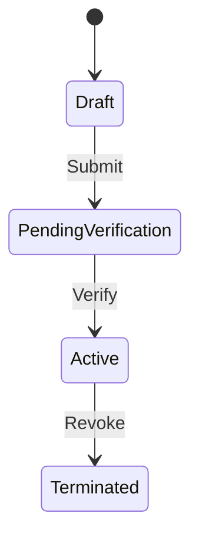

# Living Specifications (`docs/reference/`)

## Purpose & Scope
This directory serves as the enduring repository for **Living Specifications (Areas)**. It documents the current, verified operational reality of the system—capturing domain invariants, architectural trade-offs, and code maps.

## Core Directives

### 1. Code as Truth (Strict Prohibition of Stale PRDs)
- **No Stale PRDs**: Never duplicate PRD stories, API payload tables, or database column dictionaries here.
- **Code is Truth**: API contracts, database schemas, enum states, and boundary conditions are verified directly against production schemas, typed interfaces, and automated test suites.

### 2. Flat Directory Structure by Default
- Maintain a single flat level (`docs/reference/[domain].md`, e.g., `order.md`, `auth.md`, `billing.md`) to minimize retrieval latency and keep search paths short.

## Standard Living Spec Structure

Every domain reference document should follow this standardized structure:

```markdown
# [Domain Name] Living Specification

## 1. Overview
High-level domain responsibility, bounded context, and operational boundaries.

## 2. Blueprint Trade-offs & Current Scope
Summary of tactical trade-offs, deferred capabilities, or scope reductions relative to the original Blueprint.

## 3. Business Rules & Invariants
Non-negotiable domain rules, state transitions, calculation invariants, and security constraints.
- Rule 1: [Condition and invariant requirement]
- Rule 2: [Boundary constraint]

## 4. State Machines & Critical Flows
Mermaid sequence diagrams and state transitions illustrating complex, non-obvious flows:


## 5. Code Navigation Map (Code Map)
Explicit file paths linking the domain's implementation layers:
- **Schemas / Types**: `path/to/models/...`
- **Contracts / Endpoints**: `path/to/controllers/...`
- **Persistence / Data**: `path/to/repositories/...`
- **Presentation / Client**: `path/to/views/...`
- **Automated Tests**: `path/to/tests/...`
```
