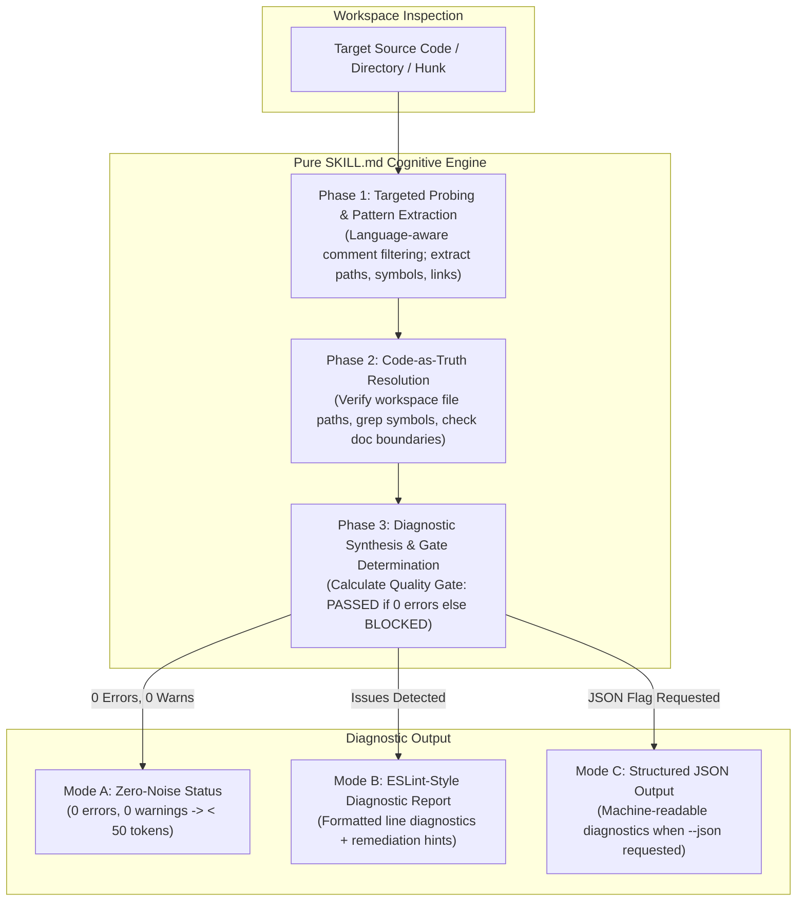

# Code Reference Integrity Living Specification (`code-reference-integrity`)

<!-- Ref: [Blueprint 1.2](../blueprint/1.2_code-reference-integrity.md) §2, §4, §5 -->

## 1. Overview

This living specification documents the domain invariants, architectural trade-offs, cognitive diagnostic rule sets, and navigation maps governing code reference integrity across repositories, anchoring directly to [Blueprint 1.2: Code Reference Integrity & Comment Hygiene](../blueprint/1.2_code-reference-integrity.md).

It establishes a **"Lint for Code Comments & Inline References"**, preventing comment rot and decayed pointers through a binary **Quality Gate (`PASSED` vs `BLOCKED`)**, zero-noise UNIX silence for clean runs, and an actionable ESLint-style diagnostic engine.

---

## 2. Blueprint Trade-offs & Current Scope

1. **Pure-Skill First (Zero-Script / Zero-Runtime)**:
   - *Blueprint Ambition*: Explored potential language-specific AST parser binaries or regex CLI tools.
   - *Tactical Decision*: Implemented strictly as a Pure `SKILL.md` cognitive workflow without auxiliary runtime dependencies. This guarantees 100% universal portability across environments lacking Node.js or Python runtimes and leverages LLM semantic context understanding over fragile static regexes.
2. **Read-Only Safety Invariant**:
   - *Trade-off*: Avoided automatic comment rewriting or stripping tools to prevent inadvertent loss of developer context or comment subtleties.
   - *Current Scope*: Strictly read-only inspection. All code changes or comment pruning are reported as actionable suggestions for interactive human and AI collaboration.
3. **Static Resolution vs Historical Inference**:
   - *Trade-off*: P1 scope (inferring replacement identifiers or moved paths by traversing `git log` commit history) is deferred to future iterations.
   - *Current Scope*: P0 capability focusing on workspace-grounded resolution (`Code as Truth`).
4. **Unidirectional Navigation Convention**:
   - *Trade-off*: Eliminated reverse pointers in code comments pointing to ephemeral progress specs (`docs/progress/**`).
   - *Current Scope*: Code points strictly to enduring blueprints (`docs/blueprint/**`) or living references (`docs/reference/**`).

---

## 3. Business Rules & Invariants

### 3.1 Non-Invasive Safety Guardrail
- The audit engine operates strictly in **read-only mode** across all source files.
- It **never** mutates, deletes, or modifies application source code or documentation during an audit run.

### 3.2 The Four Diagnostic Rule Sets

| Rule ID | Severity | Scope | Invariant Requirement |
| :--- | :--- | :--- | :--- |
| `ref/dead-file-path` | 🔴 `error` | Code comments in all source files | All explicit file paths or directory references (e.g. `// see src/utils/tax.ts`, `@see ../types.ts`) must resolve to an existing file in the workspace. |
| `ref/dead-symbol` | 🟡 `warn` | Code comments with symbol markers | Identifiers prefixed with `@see`, `see `, `defined in `, or function references (e.g. `handleCheckout()`) must resolve to a valid symbol declaration in the workspace. |
| `ref/reverse-doc-pointer` | 🟡 `warn` | Code comments in all source files | Code must never contain reverse pointers to active progress specifications (`docs/progress/**`), which are ephemeral and subject to deletion upon settlement. |
| `ref/stale-line-number` | ℹ️ `info` | Code comments with line markers | Comments must not hardcode fragile line numbers (e.g. `// see line 142 in auth.ts`, `auth.ts#L140`). |

### 3.3 Quality Gate Invariant
$$\text{Quality Gate} = \begin{cases} \mathbf{PASSED}, & \text{if } \sum \text{errors} = 0 \\ \mathbf{BLOCKED}, & \text{if } \sum \text{errors} > 0 \end{cases}$$

### 3.4 Language Standard (English-Only Maintenance)
- All diagnostic outputs, rule definitions, and living specifications must be maintained exclusively in English to ensure cross-ecosystem portability and multi-agent token efficiency.

---

## 4. State Machines & Critical Flows

### 4.1 3-Phase Cognitive Inspection Engine



### 4.2 Standard Diagnostic Output Formats

- **Mode A (Zero Noise)**:
  ```text
  ✔ Checked [N] references across [M] files in [target-path].
  ✨ 0 errors, 0 warnings. Quality Gate: PASSED.
  ```
- **Mode B (ESLint-Style Diagnostics)**:
  ```text
  [file]:[line]
    [[rule-id]] [Diagnostic message]. ([severity])
    💡 Comment: `[original comment]`
    💡 Suggestion: [Actionable remediation guidance]

  ✖ [P] problems ([E] errors, [W] warnings, [I] info)
  Quality Gate: [PASSED | BLOCKED] ([Resolution hint])

  🛠️ Remediation Guidance:
  - To fix errors, instruct your AI coding agent: "Update or remove broken references listed above."
  ```

---

## 5. Code Navigation Map (Code Map)

- **Pure Skill Implementation**: [skills/audit-stale-ref/SKILL.md](../../skills/audit-stale-ref/SKILL.md)
- **Repository Catalog**: [README.md](../../README.md)
- **Repository Standards**: [.agents/rules/skills-repository.md](../../.agents/rules/skills-repository.md)
- **Domain Master Blueprint**: [docs/blueprint/1.0_agentic-engineering-governance.md](../blueprint/1.0_agentic-engineering-governance.md)
- **Upstream Product Blueprint**: [docs/blueprint/1.2_code-reference-integrity.md](../blueprint/1.2_code-reference-integrity.md)
