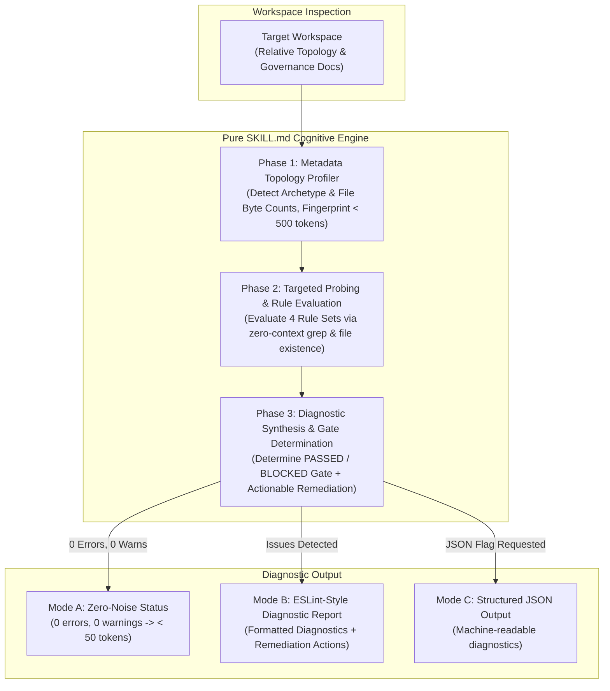

# Workflow Governance Living Specification (`workflow-governance`)

<!-- Ref: [Blueprint 1.1] §2, §4, §5 -->

## 1. Overview

This living specification documents the system invariants, architectural trade-offs, diagnostic rule sets, and navigation maps governing development workflow health across repositories, anchoring directly to [Blueprint 1.1: Adaptive Development Workflow Management](../blueprint/1.1_adaptive-skill-bootstrap.md).

It establishes an **"ESLint for Development Workflow & Markdown Governance"**, replacing arbitrary 100-point composite scoring with a binary **Quality Gate (`PASSED` vs `BLOCKED`)**, zero-noise UNIX silence for clean runs, and an actionable diagnostic engine.

---

## 2. Blueprint Trade-offs & Current Scope

1. **Pure-Skill First (Zero-Script / Zero-Runtime)**:
   - *Blueprint Ambition*: Explored potential auxiliary inspection scripts (`scripts/audit-workflow.py` or `.js`).
   - *Tactical Decision*: Implemented strictly as a Pure `SKILL.md` cognitive workflow without auxiliary scripts. This ensures 100% universal portability across environments lacking Node.js or Python runtimes and leverages LLM semantic evaluation over fragile, regex-based parsing.
2. **Binary Quality Gate vs Composite Scoring**:
   - *Trade-off*: Eliminated numeric composite scoring (e.g. "85/100") to avoid the *compensatory fallacy* where high scores in documentation volume mask critical broken Code Map navigation errors.
   - *Current Scope*: Binary gate where any `error` immediately blocks the gate, while `warn` flags advisories without blocking delivery.
3. **Token-Guarded Inspection Protocol**:
   - *Trade-off*: Imposes strict metadata-first listing and line-range slicing over full file reads, capping diagnostic context overhead at $< 2,000$ tokens.
4. **Unidirectional Navigation Convention**:
   - *Trade-off*: Eliminated bidirectional reverse reference comments (`// Ref: ...` or `<!-- Ref: ... -->`) in production code and skills.
   - *Current Scope*: All navigation pointers are maintained unilaterally in `docs/reference/[domain].md` (Code Navigation Map). Source code and skill definitions remain 100% decoupled and portable, eliminating redundant maintenance overhead when files move.

---

## 3. Business Rules & Invariants

### 3.1 Non-Invasive Safety Guardrail
- The audit engine operates strictly in **read-only mode** on repository governance artifacts (`AGENTS.md`, `.agents/`, `docs/`).
- It **never** mutates, deletes, or modifies application source code or documentation during an audit run.

### 3.2 The Four Diagnostic Rule Sets

| Rule ID | Severity | Scope | Invariant Requirement |
| :--- | :--- | :--- | :--- |
| `consistency/no-manual-status-header` | 🔴 `error` | `docs/progress/**` | Documents must never contain manual status headers (`Status: Draft`, `Status: In Progress`). Status is strictly derived from directory path (**Path-as-Status**). |
| `consistency/no-broken-relative-links` | 🔴 `error` | `docs/**`, `AGENTS.md` | All local relative markdown links must resolve to existing files or directories. |
| `friction/max-token-overhead` | 🟡 `warn` | `docs/convention/**`, `.agents/rules/**` | Flag convention files $> 3,000$ tokens ($\text{bytes} / 3.8$ for ASCII; $\text{bytes} / 2.0$ for CJK). Flag $> 6,000$ tokens as monolithic files requiring modular decomposition. |
| `friction/no-bloated-schema-tables` | 🟡 `warn` | `docs/convention/**` | Tables in convention files must not contain $> 8$ rows of type/field DTO definitions. |
| `truth/no-duplicate-api-dictionaries` | 🟡 `warn` | `docs/reference/**` | Living specifications must never duplicate API payload tables or database schema dictionaries (**Code as Truth**). |
| `traceability/valid-codemap-paths` | 🔴 `error` | `docs/reference/*.md` | All file paths declared in Code Navigation Maps must exist in the workspace. |
| `traceability/valid-blueprint-mapping` | 🔴 `error` | `docs/progress/[code]/` | Active slice directories must map to an existing Blueprint under `docs/blueprint/`. For `skills-repository`, skills must follow `skills/<name>/SKILL.md`. |

### 3.3 Quality Gate Invariant
$$\text{Quality Gate} = \begin{cases} \mathbf{PASSED}, & \text{if } \sum \text{errors} = 0 \\ \mathbf{BLOCKED}, & \text{if } \sum \text{errors} > 0 \end{cases}$$

### 3.4 Language Standard (English-Only Maintenance)
- All governance artifacts (`AGENTS.md`, `.agents/rules/**`), lifecycle specifications (`docs/**`), and skill definitions (`skills/**`) must be maintained in English to ensure cross-ecosystem portability and zero cognitive friction for polyglot AI coding agents.

---

## 4. State Machines & Critical Flows

### 4.1 3-Phase Cognitive Inspection Engine



### 4.2 Standard Diagnostic Output Formats

- **Mode A (Zero Noise)**:
  ```text
  ✔ Checked [N] governance files across 4 dimensions.
  ✨ 0 errors, 0 warnings. Quality Gate: PASSED (Archetype: [archetype]).
  ```
- **Mode B (ESLint-Style Diagnostics)**:
  ```text
  [file]:[line]
    [[rule-id]] [Diagnostic message]. ([severity])

  ✖ [P] problems ([E] errors, [W] warnings)
  Quality Gate: BLOCKED ([Resolution hint])

  🛠️ Recommended Action Items:
  1. [Actionable remediation step]
  ```

---

## 5. Code Navigation Map (Code Map)

- **Pure Skill Implementation**: [skills/audit-workflow-fitness/SKILL.md](../../skills/audit-workflow-fitness/SKILL.md)
- **Repository Catalog**: [README.md](../../README.md)
- **Repository Standards**: [.agents/rules/skills-repository.md](../../.agents/rules/skills-repository.md)
- **Governance Directives**: [AGENTS.md](../../AGENTS.md)
- **Lifecycle Engine Guide**: [CONTRIBUTING.md](../../CONTRIBUTING.md)
- **Upstream Product Blueprint**: [docs/blueprint/1.1_adaptive-skill-bootstrap.md](../blueprint/1.1_adaptive-skill-bootstrap.md)
