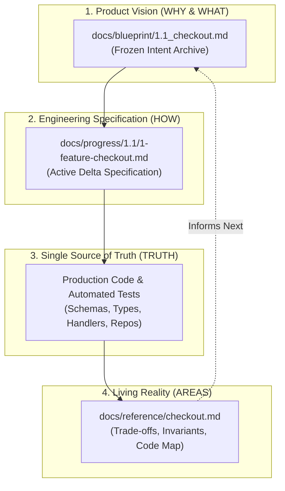
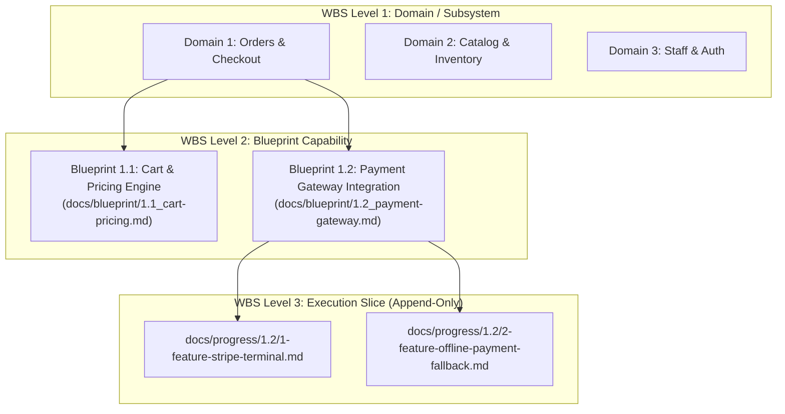
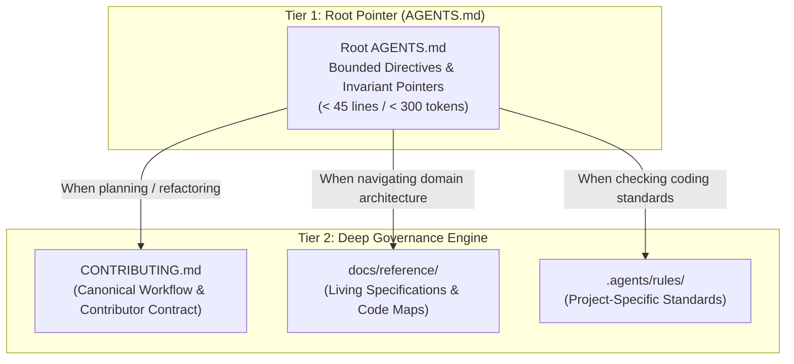

# Architectural Guide: Blueprint-Driven Development (BDD)

## 1. Introduction & The "Vibe-Coding" Problem

In the era of AI coding agents and large language models (LLMs), software teams often encounter the **"Vibe Coding Trap"**:
- An engineer prompts the AI with an ad-hoc requirement.
- The AI generates code that solves the immediate prompt, but invents its own architectural boundaries, hallucinates nonexistent schema fields ("ghost fields"), and disregards system-wide trade-offs.
- Documentation rots instantly, context windows fill with outdated transcripts, and the codebase gradually dissolves into unmaintainable spaghetti.

**Blueprint-Driven Development (BDD)** addresses this breakdown by applying civil engineering discipline to AI-assisted software construction:
> **"Finalize the engineering drawings before pouring concrete."**



---

## 2. The PARA Documentation Mapping

BDD adopts the principles of the **PARA Method** (Projects, Areas, Resources, Archive), tailoring them specifically for software repositories and AI agents:

| PARA Concept | Repository Path | Role & Invariant | Lifecycle & Retention |
| :--- | :--- | :--- | :--- |
| **Vision (WHY)** | `docs/blueprint/` | Captures ideal user journeys, personas, and long-term business goals. | **Frozen Archive**: Never mutated for tactical implementation trade-offs. |
| **Projects (HOW)** | `docs/progress/` | Active development milestones, end-to-end vertical slices, and contract deltas. | **Ephemeral & Append-Only**: Path-as-status; deleted upon verification through the Settle Gatekeeper. |
| **Areas (TRUTH)** | `docs/reference/` | Enduring domain living specifications, business invariants, and code navigation maps. | **Evergreen Living Reality**: Flat by default; strictly prohibits duplicate field tables. |
| **Resources** | Codebase & Conventions | Production code, schemas, build tools, and `CONTRIBUTING.md`. | Primary operational assets. |

---

## 3. The Three Invariant Guardrails

### 3.1 Unidirectional Spec Chain Guard
Software components follow a strict dependency sequence:
$$\text{Mechanism} \longrightarrow \text{Domain Schemas / Types} \longrightarrow \text{Endpoint Contracts} \longrightarrow \text{Domain State} \longrightarrow \text{Handlers / Repos / UI}$$

- **Rule**: Downstream components cannot unilaterally alter upstream design. If an endpoint requires aggregated fields, the domain entity model must first be updated upstream.
- **Escalation**: When upstream specifications are unworkable, stop downstream work and initiate a formal upstream revision.

### 3.2 Ghost Field Gatekeeper (Truth Tracing)
- **Problem**: AI agents frequently invent synthetic fields in UI templates or client mocks that have no backing in the backend schema.
- **Guardrail**: Every field rendered in presentation layers or DTO responses must trace back to a declared entity property or a pure domain formatter. Unsubstantiated fields must trigger an immediate halt.

### 3.3 Settle Gatekeeper (Three-Question Test)
Before any active specification in `docs/progress/` can be deleted upon feature completion, the agent or developer must evaluate:
1. *Does this specification contain Mermaid sequence diagrams or state machine flows not immediately obvious from reading the code?*
2. *Does this specification contain critical fault-tolerance, offline degradation, or quarantine recovery rules?*
3. *Can a future engineer or AI agent understand this mechanism entirely from the remaining code and Reference documentation?*

If (1) or (2) is "Yes", the content must be consolidated into `docs/reference/[domain].md` before the progress file is deleted.

---

## 4. Universal Polyglot Implementation

The principles of Blueprint-Driven Development apply identically across any programming language:

| Architectural Layer | TypeScript / Node | Go | Rust | Python | Java / Kotlin |
| :--- | :--- | :--- | :--- | :--- | :--- |
| **Schema / Contract** | TypeBox, Zod, TS Interfaces | Structs, Protobuf, OpenAPI | Rust Structs, Serde, Tonic | Pydantic Models, Dataclasses | Records, Jackson, Protobuf |
| **Service & Handlers** | Fastify, Express, NestJS | Gin, Chi, Echo, gRPC | Axum, Actix, Tonic | FastAPI, Django, Flask | Spring Boot, Quarkus, Micronaut |
| **Data Access** | LibSQL, Drizzle, Prisma | GORM, sqlx, pgx | SQLx, Diesel, SeaORM | SQLAlchemy, Tortoise | JPA, Hibernate, jOOQ |
| **Automated Verification** | Vitest, Jest | `go test` | `cargo test` | `pytest` | JUnit, Kotest |

---

## 5. The 3-Tier Pragmatic Work Breakdown Structure (WBS)

To balance hierarchical traceability with software agility, BDD enforces a **3-Tier Pragmatic WBS** that strictly eliminates arbitrary leading zeros.



### 5.1 Structure & Symmetric Mapping

| Tier | Granularity | Path & Naming Pattern | Lifecycle & Retention |
| :--- | :--- | :--- | :--- |
| **Level 1 (Domain)** | High-level bounded context | Integer prefix: `1`, `2`, `3` | Permanent architectural boundaries. |
| **Level 2 (Blueprint)** | Product user journey / capability | `docs/blueprint/[L1].[L2]_[slug].md`<br>*Example*: `docs/blueprint/1.2_payment-gateway.md` | **Frozen Intent Archive**: Anchors long-term vision; never edited for tactical trade-offs. |
| **Level 3 (Progress Slice)** | In-flight execution work package | `docs/progress/[L1].[L2]/[Slice]-feature-[slug].md`<br>*Example*: `docs/progress/1.2/1-feature-stripe.md` | **Symmetric & Ephemeral**: Subdirectory strictly mirrors Blueprint code; deleted upon Settle. |
| **Settled (Living Area)** | Verified production reality | `docs/reference/[domain].md`<br>*Example*: `docs/reference/checkout.md` | **Evergreen**: Unversioned living spec capturing business invariants, trade-offs, and Code Maps. |

### 5.2 Rationale for Eliminating Leading Zeros (No `01.1`)
1. **International Standards Alignment**: Standard WBS (PMI / ISO 21500), RFC sections, legal citations, and SemVer use pure natural numbers (`1.1`, `1.2`, `10.1`), never `01.01`.
2. **Native Natural Sort**: Modern IDEs (VS Code, JetBrains), GitHub Web UI, and operating systems natively sort numbers numerically (`1.1` ➔ `9.1` ➔ `10.1`), rendering artificial `0`-padding obsolete.
3. **Infinite Scalability**: Pure integers scale smoothly beyond 99 domains or slices without requiring retroactive filename refactoring (`001`).
4. **Immediate Human & Machine Traceability**: Seeing `docs/progress/1.2/` instantly maps to `docs/blueprint/1.2_...` without needing an index table.

---

## 6. Two-Tier Pointer Architecture & Non-Destructive Adoption

To keep LLM context consumption lean while maintaining rigorous governance, BDD adopts the **Two-Tier Pointer Architecture**:



### 6.1 Bounded Marker Invariant (`<!-- blueprint-workflow:start -->`)
To ensure deterministic, idempotent updates across both Greenfield and Brownfield codebases:
- Core BDD directives are enclosed in explicit comment boundaries:
  ```markdown
  <!-- blueprint-workflow:start -->
  ## Development Workflow & Governance Directives
  ... (5 Core Principles) ...
  <!-- blueprint-workflow:end -->
  ```
- **Greenfield Deployment**: `templates/AGENTS.md` is pre-packaged with bounded markers.
- **Brownfield Adoption**: Existing directives or custom rules outside the marker block are never overwritten.
- **Non-Destructive Update**: When marker blocks exist but content differs, agents must present a side-by-side diff and prompt the user rather than silently overwriting customized directives.

### 6.2 Separation of Concerns
1. **BDD Core Directives**: Inside the marker block (Workflow & Lifecycle, Stage Gate Isolation, Path-as-Status, Code as Truth, Spec Immutability).
2. **Project-Specific Standards**: Maintained strictly outside the marker block (e.g., under `## Project Specific Standards`), preserving build commands, environment setups, and custom linters across future workflow upgrades.

