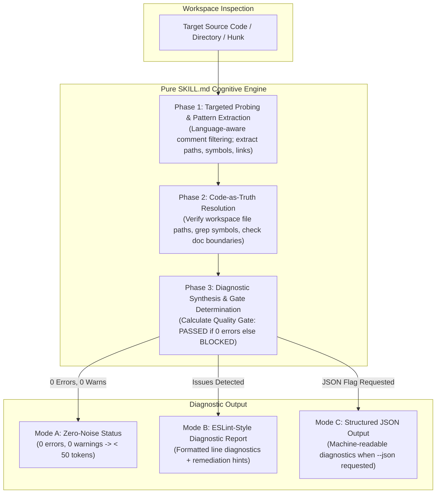

# Code Reference Integrity Auditor (`audit-stale-ref`)

A strictly read-only, token-efficient cognitive diagnostic auditor that inspects internal references in code comments (file paths, symbols, line numbers, and documentation links) across target codebases, flags stale or decayed pointers, and produces actionable ESLint-style diagnostic reports with a binary **Quality Gate (`PASSED` vs `BLOCKED`)**.



---

## When to Run This Skill

Activate this skill when:
- Refactoring, relocating, or renaming files to detect orphaned or stale comment pointers across the codebase.
- Reviewing pull requests or active changesets to prevent decayed references from polluting production code comments.
- Auditing comment hygiene to eliminate reverse architectural coupling back to ephemeral progress specifications (`docs/progress/**`).
- Preparing codebases for long-term maintainability without letting comments turn into misleading anti-documentation.

---

## Non-Invasive Safety Invariant (Strict Read-Only)

> [!IMPORTANT]
> **Strict Read-Only Operations**: The audit engine operates exclusively in read-only mode across target source files. Under no circumstances does the skill execute file modification tools (`replace_file_content`, `multi_replace_file_content`, `write_to_file`). All remediation suggestions, comment pruning, and link adjustments are delegated to interactive collaboration between the engineer and the AI coding agent.

---

## Token-Guarded Inspection Protocol

To prevent cognitive overload and avoid consuming excessive context tokens by indiscriminately dumping full source files into context, the agent must strictly adhere to the **Token Discipline Protocol**:

1. **Language-Aware Comment Filtering**: Do not read files end-to-end. Use targeted regex or slice searches to locate comment markers matching the language:
   - C-style / JS / TS / Go / Rust / Java / C#: `//`, `/* ... */`
   - Python / Shell / Ruby / YAML: `#`
   - SQL / Lua: `--`
   - HTML / Markdown / XML: `<!-- ... -->`
2. **Selective Slice Reading**: View only the immediate comment context and surrounding declarations using line-range slicing (`StartLine` / `EndLine`).
3. **Context Overhead Constraint**: Inspecting a typical 5-file module must complete within $< 2,500$ tokens of total context consumption.

---

## Diagnostic Rule Sets

All findings are classified into three severity levels:
- 🔴 **`error` (Blocker)**: Critical reference breaks (e.g. non-existent file paths). **Any error immediately blocks the Quality Gate.**
- 🟡 **`warn` (Advisory Smell)**: High architectural friction or broken symbol pointers that degrade context. Warnings do not block the gate by default.
- ℹ️ **`info` (Hygiene Notice)**: Fragile comment markers (e.g., hardcoded line numbers).

| Rule ID | Severity | Scope | Invariant Requirement |
| :--- | :--- | :--- | :--- |
| `ref/dead-file-path` | 🔴 `error` | Code comments in all source files | All explicit file paths or directory references (e.g. `// see src/utils/tax.ts`, `@see ../types.ts`) must resolve to an existing file in the workspace. |
| `ref/dead-symbol` | 🟡 `warn` | Code comments with symbol markers | Identifiers prefixed with `@see`, `see `, `defined in `, or function references (e.g. `handleCheckout()`) must resolve to a valid symbol declaration in the workspace. |
| `ref/reverse-doc-pointer` | 🟡 `warn` | Code comments in all source files | Code must never contain reverse pointers to active progress specifications (`docs/progress/**`), which are ephemeral and subject to deletion upon settlement. |
| `ref/stale-line-number` | ℹ️ `info` | Code comments with line markers | Comments must not hardcode fragile line numbers (e.g. `// see line 142 in auth.ts`, `auth.ts#L140`). |

### Quality Gate Equation

$$\text{Quality Gate} = \begin{cases} \mathbf{PASSED}, & \text{if } \sum \text{errors} = 0 \\ \mathbf{BLOCKED}, & \text{if } \sum \text{errors} > 0 \end{cases}$$

---

## 3-Phase Cognitive Inspection Procedure

### Phase 1: Targeted Probing & Pattern Extraction

1. **Identify Target Scope**:
   - Determine target files or directories specified by the user (default: current workspace or active diff).
   - Ignore build artifacts, dependencies, and caches (`node_modules`, `.git`, `dist`, `build`, `vendor`, `.turbo`).
2. **Scan for Comment References**:
   - Search for comment lines matching:
     - Path patterns: `./`, `../`, `src/`, `libs/`, `apps/`, `packages/`, or file extensions (`.ts`, `.js`, `.py`, `.go`, `.rs`, `.md`).
     - Symbol annotations: `@see [identifier]`, `see [identifier]`, `defined in [identifier]`, `called by [identifier]`, `[identifier]()`.
     - Spec links: `Ref: `, `RFC-`, `spec: `, `docs/progress/`.

### Phase 2: Code-as-Truth Resolution

1. **Path Reference Resolution (`ref/dead-file-path`)**:
   - Relative paths (`./...`, `../...`): Resolve relative to the directory containing the file under inspection.
   - Root-relative paths (`src/...`, `libs/...`, `packages/...`): Resolve relative to the repository/workspace root.
   - If the file does not physically exist in the workspace $\rightarrow$ emit `ref/dead-file-path` (`error`).
2. **Symbol Resolution (`ref/dead-symbol`)**:
   - Extract the referenced identifier, stripping parentheses `()`, quotes, and trailing punctuation.
   - Perform a targeted grep across the workspace for declarations (e.g., `function [name]`, `class [name]`, `const [name] =`, `export const [name]`).
   - If the symbol cannot be found $\rightarrow$ emit `ref/dead-symbol` (`warn`).
3. **Architecture Boundary Check (`ref/reverse-doc-pointer`)**:
   - Check if any comment reference links to `docs/progress/**` or active development slice files.
   - Code must point exclusively to enduring blueprints (`docs/blueprint/**`) or living references (`docs/reference/**`).
   - If pointing to `docs/progress/**` $\rightarrow$ emit `ref/reverse-doc-pointer` (`warn`).
4. **Fragility Check (`ref/stale-line-number`)**:
   - Check if comments specify explicit line numbers (e.g. `line \d+` or `#L\d+`).
   - If found $\rightarrow$ emit `ref/stale-line-number` (`info`).

### Phase 3: Diagnostic Synthesis & Gate Evaluation

Aggregate findings, calculate the Quality Gate, and format the diagnostic output:

---

## Standard Diagnostic Output Formats

### Mode A: Zero-Noise Status (0 Problems)
When no issues are found, maintain UNIX silence with minimal token output:

```text
✔ Checked [N] references across [M] files in [target-path].
✨ 0 errors, 0 warnings. Quality Gate: PASSED.
```

### Mode B: ESLint-Style Diagnostic Report (Problems Found)
When problems are detected, provide line-anchored actionable reporting:

```text
[file]:[line]
  [[rule-id]] [Diagnostic description]. ([severity])
  💡 Comment: `[original comment]`
  💡 Suggestion: [Actionable remediation guidance]

✖ [P] problems ([E] errors, [W] warnings, [I] info)
Quality Gate: [PASSED | BLOCKED] ([Resolution hint])

🛠️ Remediation Guidance:
- To fix errors, instruct your AI coding agent: "Update or remove broken references listed above."
```

### Mode C: Structured JSON Output (When `--json` is requested)
When structured output is requested:

```json
{
  "target": "src/services/billing",
  "filesChecked": 5,
  "referencesScanned": 12,
  "qualityGate": "BLOCKED",
  "summary": {
    "errors": 1,
    "warnings": 1,
    "info": 0
  },
  "diagnostics": [
    {
      "file": "src/services/billing/invoice.ts",
      "line": 42,
      "ruleId": "ref/dead-file-path",
      "severity": "error",
      "comment": "// see calculateTax() in src/utils/legacy-tax.ts",
      "message": "Referenced path `src/utils/legacy-tax.ts` does not exist.",
      "suggestion": "The tax logic appears to have moved to `src/domain/tax/calculator.ts`."
    }
  ]
}
```

---

## Language Standard (English-Only Maintenance)

All diagnostic outputs, rules, and documentation must be maintained in English to ensure cross-ecosystem portability and consistent token efficiency across multi-agent toolchains.
