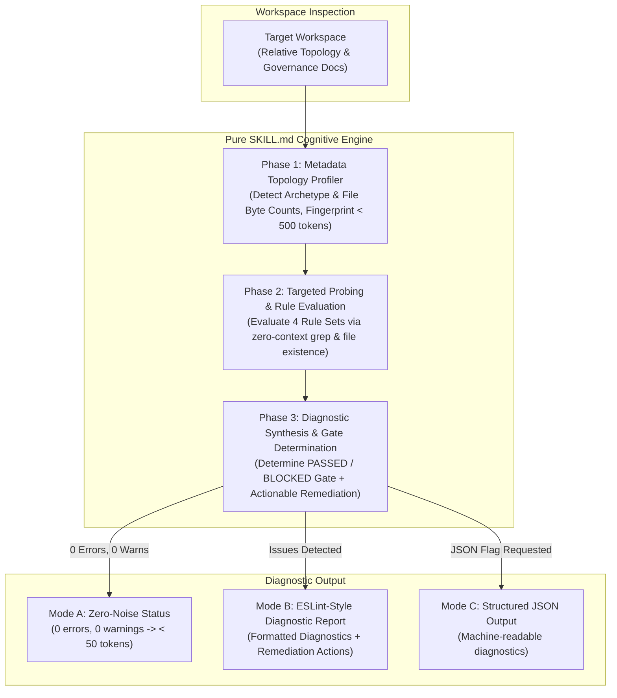

# Audit Workflow Fitness (`audit-workflow-fitness`)

A portable, language-agnostic diagnostic skill that operates as a **"Lint for Development Workflow & Markdown Governance"**.

Departing from arbitrary 100-point composite scoring models, this skill eliminates the compensatory fallacy (where high scores in unrelated areas obscure critical navigation failures). It classifies findings into actionable **`error` (blocker)** and **`warn` (advisory smell)** diagnostics with a strict **Quality Gate (`PASSED` vs `BLOCKED`)**.

Adopting a **Pure `SKILL.md` (Zero-Script / Zero-Runtime)** architecture, this skill achieves universal portability across any operating environment (regardless of Node.js or Python availability) and leverages the AI Agent's semantic understanding to avoid rigid, false-positive-heavy regex checks while strictly preventing token blow-up through a metadata-first inspection protocol and UNIX silence ("Silence is golden").



---

## When to Run This Skill

Activate this skill when:
- Evaluating a repository's documentation architecture and workflow health before starting a major development cycle.
- Checking for workflow drift, broken Code Map pointers, or outdated PRDs in living specifications.
- Validating that active progress specs follow Path-as-Status without prohibited manual status tags.
- Verifying whether rules and conventions have bloated into monolithic token sinks (> 3,000 tokens).
- Running pre-merge or CI workflow quality gates to ensure documentation remains aligned with code as truth.

---

## Non-Invasive Safety Guardrail

> [!IMPORTANT]
> **Strict Read-Only Operations**: The audit engine operates exclusively in read-only mode on repository governance artifacts (`AGENTS.md`, `.agents/`, `docs/`). It **never** mutates, deletes, or modifies application source code or documentation during an audit run. Remediation suggestions are presented in the report for developer review and execution.

---

## Token-Guarded Inspection Protocol (Strict Constraint)

To prevent cognitive overload and avoid consuming tens of thousands of tokens by indiscriminately dumping full documents into context, the agent must strictly execute the **Metadata-First Protocol**:

1. **Never read full convention/reference files upfront**: File token weights must be estimated from directory listing byte counts (`bytes / 3.8` for ASCII; `bytes / 2.0` for CJK / multi-byte UTF-8) obtained via `list_dir` or file stats.
2. **Targeted probing**: Search for broken relative links, invalid Code Map references, and governance anti-patterns using zero-context pattern searching (`grep_search` / `grep` / existence tests) without loading full file bodies.
3. **Selective slice reading**: If a violation or broken link is suspected, view only the relevant line range (`StartLine` / `EndLine`) rather than loading entire files.
4. **Context Budget**: The complete audit workflow should consume $< 2,000$ tokens of context overhead.

---

## 3-Phase Cognitive Evaluation Procedure

### Phase 1: Metadata Topology Profiler (< 500 tokens)

1. **Identify Project Archetype**:
   - `skills-repository`: Presence of a top-level `skills/` directory containing `*/SKILL.md` files.
   - `monorepo`: Presence of `pnpm-workspace.yaml`, `nx.json`, `lerna.json`, `go.work`, or `Cargo.toml` with `[workspace]`.
   - `application`: Standard single-package configurations (`package.json`, `Cargo.toml`, `go.mod`, `pyproject.toml`, etc.) without workspace files.
2. **Catalog Governance Artifacts**:
   - Check presence and file sizes of:
     - Root governance: `AGENTS.md`, `CLAUDE.md`, `.cursorrules`, `GEMINI.md`.
     - Spec directories: `docs/blueprint/`, `docs/progress/`, `docs/reference/`, `docs/convention/`, `.agents/rules/`.
     - Workflow engine: `docs/dev-workflow.md`.
3. **Compute Byte & Token Footprint**:
   - Calculate total byte counts for governance documents.
   - Derive estimated token counts:
     $$\text{Tokens}_{\text{est}} \approx \begin{cases} \text{bytes} / 3.8, & \text{ASCII} \\ \text{bytes} / 2.0, & \text{CJK / Multi-byte} \end{cases}$$

---

### Phase 2: Targeted Probing Across 4 Rule Sets

Categorize all findings into two strict severity levels:
- 🔴 **`error` (Blocker)**: Critical failures that break agent navigation, cause runtime tool-call crashes, or violate core lifecycle invariants. **Any `error` immediately blocks the Quality Gate.**
- 🟡 **`warn` (Advisory Smell)**: High token friction, documentation bloat, or anti-patterns that degrade agent context without completely breaking execution. **Warnings do not block the gate.**

$$\text{Quality Gate} = \begin{cases} \mathbf{PASSED}, & \text{if } \text{errors} = 0 \\ \mathbf{BLOCKED}, & \text{if } \text{errors} > 0 \end{cases}$$

#### Rule Set 1: `consistency` (Governance Consistency & Anti-Pattern Rules)

- **`consistency/no-manual-status-header` (`error`)**:
  - Scan `docs/progress/**` for prohibited manual lifecycle status fields (`Status: Draft`, `Status: In Progress`, `Status: Completed`, etc.).
  - Lifecycle status must be strictly inferred from the directory path (Path-as-Status).
- **`consistency/no-broken-relative-links` (`error`)**:
  - Scan markdown links inside `docs/` and `AGENTS.md` targeting local workspace files using relative paths (e.g., `[text](./path)` or `[text](../path)`).
  - Verify every referenced relative path resolves to an existing file or directory.

#### Rule Set 2: `friction` (Cognitive & Token Friction Rules)

- **`friction/max-token-overhead` (`warn`)**:
  - Check estimated token counts across all rule and convention files (`docs/convention/**`, `.agents/rules/**`, `AGENTS.md`).
  - Trigger a warning if any individual convention file exceeds ~3,000 tokens ($\approx \text{bytes} / 3.8$ for ASCII, $\text{bytes} / 2.0$ for CJK).
  - Flag files $> 6,000$ tokens as high-friction monolithic files requiring decomposition.
- **`friction/no-bloated-schema-tables` (`warn`)**:
  - Inspect markdown convention files for prohibited bloated schema/field tables (tables containing $> 8$ rows of type/field DTO definitions, rather than concise architectural comparison tables).

#### Rule Set 3: `truth` (Code-as-Truth Purity Rules)

- **`truth/no-duplicate-api-dictionaries` (`warn`)**:
  - Verify that living specifications in `docs/reference/` do not duplicate API payload tables, JSON request bodies, or database schema column dictionaries.
  - Ensure reference files focus strictly on business invariants, trade-offs, state machines (Mermaid), and Code Maps, delegating data structures to production code contracts.

#### Rule Set 4: `traceability` (Traceability & Lifecycle Alignment Rules)

- **`traceability/valid-codemap-paths` (`error`)**:
  - Validate that paths referenced in `docs/reference/*.md` Code Navigation Maps exist in the codebase.
  - Prevents agent hallucination and navigation failure caused by stale code pointers.
- **`traceability/valid-blueprint-mapping` (`error`)**:
  - Validate that active slice directories under `docs/progress/[code]/` correspond to a valid blueprint code in `docs/blueprint/`.
  - For `skills-repository` archetypes, verify adherence to `.agents/rules/skills-repository.md` (e.g., standard skill directory structure `skills/<skill-name>/SKILL.md` and bulleted catalog links).

---

### Phase 3: Diagnostic Synthesis & Gate Determination

Aggregate findings and evaluate the binary Quality Gate:

#### Mode A: Clean Run (UNIX Silence / Zero Noise)
When 0 errors and 0 warnings are detected:
```text
✔ Checked [N] governance files across 4 dimensions.
✨ 0 errors, 0 warnings. Quality Gate: PASSED (Archetype: [archetype]).
```

#### Mode B: Issues Detected (ESLint-Style Diagnostic Report)
When diagnostics are present:
```text
[file]:[line]
  [[rule-id]] [Diagnostic message]. ([severity])

✖ [P] problems ([E] errors, [W] warnings)
Quality Gate: [BLOCKED/PASSED] ([Resolution hint])

🛠️ Recommended Action Items:
1. [Actionable step for issue 1]
2. [Actionable step for issue 2]
```

#### Mode C: Structured JSON Output (Optional)
When structured output is requested:
```json
{
  "gate": "PASSED | BLOCKED",
  "archetype": "skills-repository | monorepo | application",
  "summary": {
    "filesChecked": 14,
    "errors": 0,
    "warnings": 0
  },
  "diagnostics": [
    {
      "rule": "consistency/no-manual-status-header",
      "severity": "error",
      "file": "docs/progress/1.1/1-feature.md",
      "line": 4,
      "message": "Found prohibited 'Status: Draft'. Infer status from directory path.",
      "suggestedFix": "Remove line 4."
    }
  ]
}
```

---

## Actionable Remediation Guidelines

When diagnosing violations, provide direct, copy-pasteable remediation instructions:
1. **Manual Status Header**: "Remove explicit status declarations from header. Move document to appropriate lifecycle folder (`docs/progress/` for WIP, `docs/reference/` for settled invariants)."
2. **Broken Link / Stale Code Map**: "Update relative path `[broken/path]` to existing file `[valid/path]`, or prune obsolete pointer."
3. **Token Friction**: "Split monolithic document into modular topical files (e.g., `docs/convention/naming.md`, `docs/convention/error-handling.md`)."
4. **Duplicate API Dictionary**: "Remove static table and replace with a direct pointer to production schema or typed contract in code."
