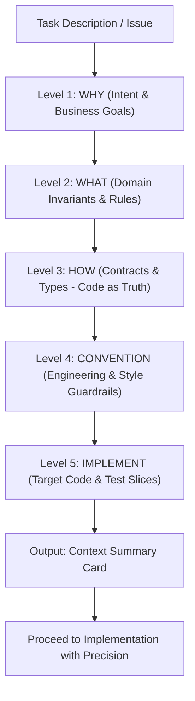

# Progressive Context Loader

A systematic, token-efficient workflow for AI coding agents to gather codebase context without blowing up the context window or hallucinating implementations.

Instead of dumping dozens of files into context all at once, this skill enforces a **5-Level Progressive Context Pyramid**. Each level acts as an invariant filter before moving deeper.



---

## When to Use This Skill

Activate this skill when:
- Starting a non-trivial feature, refactor, or bug fix in an unfamiliar or large codebase.
- Working in a Monorepo, Clean Architecture, or multi-package repository.
- Preventing LLM attention degradation ("Lost in the Middle") caused by reading thousands of lines of irrelevant code.
- Ensuring implementations strictly follow project conventions, naming rules, and upstream architecture contracts.

---

## The 5-Level Context Pyramid

### Level 1: WHY — Intent & High-Level Goal
- **Objective**: Anchor the problem being solved. What is the business rationale and expected user flow?
- **Where to look**: Issue description, PRD, Blueprint, or high-level RFC.
- **Budget**: ~300 – 600 tokens.
- **Rules**:
  - Read **ONLY** the Overview, User Story, or Problem Statement section.
  - DO NOT read technical specs or API endpoints yet.

### Level 2: WHAT — Domain Invariants & Business Rules
- **Objective**: Identify non-negotiable business constraints and trade-offs before touching code.
- **Where to look**: Living specs, ADRs, `docs/reference/[domain].md`, or Domain READMEs.
- **Budget**: ~600 – 1,200 tokens.
- **Rules**:
  - Look for "Business Rules", "Invariants", "Trade-offs", or "State Machine" sections.
  - Understand boundary conditions (e.g., "vouchers cannot be redeemed if status is EXPIRED").

### Level 3: HOW — Contracts & Data Types (Code as Truth)
- **Objective**: Establish the exact data structures and API shapes. **The code is the single source of truth**, not outdated documents.
- **Where to look**: TypeScript type definitions, DTO schemas (TypeBox, Zod), API contracts, GraphQL schemas, database DDL.
- **Budget**: ~1,200 – 2,500 tokens.
- **Rules**:
  - Read **interfaces and types only**. Do NOT read implementation logic (controller handlers, business services).
  - Check fields, nullability, enum states, and relation boundaries.

### Level 4: CONVENTION — Engineering & Style Guardrails
- **Objective**: Pinpoint project conventions and patterns so the code integrates seamlessly into the codebase.
- **Where to look**: `docs/convention/`, `.eslintrc`, style guides, or architecture pattern docs.
- **Budget**: ~800 – 1,500 tokens.
- **Targeted Convention Routing** (Read ONLY what touches your change):
  | Change Scope | Target Conventions | Guardrail Focus |
  | :--- | :--- | :--- |
  | **All Tasks** | Naming convention / Style guide | Casing, file/folder names, abbreviation prohibitions. |
  | **Frontend UI / Hooks** | React / UI convention | State boundaries, hook dependencies, i18n keys, prohibited side-effects. |
  | **API Endpoints** | Handler convention, Error convention | Controller signature, unified error response (`AppError`), HTTP status codes. |
  | **Data Layer** | Repo convention, Migration SOP | Transaction patterns, query builder rules, version bumping SOP. |
- **Rules**:
  - **Never read entire convention files end-to-end**. Use `grep_search` or slice reading (`view_file` with start/end lines) to check the relevant sections.

### Level 5: IMPLEMENT — Target Implementation & Test Slices
- **Objective**: Locate the exact 1–3 files to be modified and their corresponding test files.
- **Where to look**: Specific source files identified via Code Map or targeted search.
- **Budget**: ~2,000 – 4,000 tokens.
- **Rules**:
  - Use line-range slicing when reading large files (> 150 lines).
  - Always locate the corresponding unit/integration test file alongside the source code.

---

## Context Loading Checklist (Invariant Guardrails)

Before writing any code or proposing diffs, verify:
- [ ] **Token Discipline**: Did I avoid reading more than 300 lines of unneeded code in one go?
- [ ] **Truth Hierarchy**: Did I verify field types against source code (`*.types.ts` / DDL) rather than prose documentation?
- [ ] **Convention Check**: Did I inspect the specific naming, error handling, and framework conventions for this layer?
- [ ] **Test Anchoring**: Did I identify the test suite that will validate my change before editing?

---

## Output: Context Summary Card

After traversing the 5 levels, generate a compact **Context Summary Card** in your conversation turn. This serves as the verified execution blueprint:

```markdown
### 📋 Context Summary Card

- **Task (WHY)**: [Concise 1-sentence goal, e.g. Add session renewal countdown]
- **Domain Invariants (WHAT)**:
  - [Rule 1: e.g. Session must be in AUTHENTICATED state to renew]
  - [Rule 2: e.g. Revoke access immediately if expired]
- **Contracts & Truth (HOW)**:
  - Model/Interface: `UserSession` in `packages/core/types/session.ts`
  - Critical Fields: `status: 'AUTHENTICATED' | 'EXPIRED'`, `expiresAt: string`
- **Applicable Conventions**:
  - Naming: Kebab-case files, PascalCase components.
  - Framework: Custom hook must return `{ data, isLoading, error }` pattern.
  - Error: Use unified `AppError.Unauthorized()` matching project error conventions.
- **Target Files & Slices**:
  - `src/features/auth/hooks/useSessionExpiry.ts:L30-L75`
  - `src/features/auth/components/SessionExpiryBadge.tsx`
  - Test: `src/features/auth/hooks/__tests__/useSessionExpiry.test.ts`
```

---

## Additional References

- [Context Pyramid Architecture & Mapping Matrix](./references/context-pyramid.md)
- [Example Context Summary Card](./examples/context-summary-example.md)
