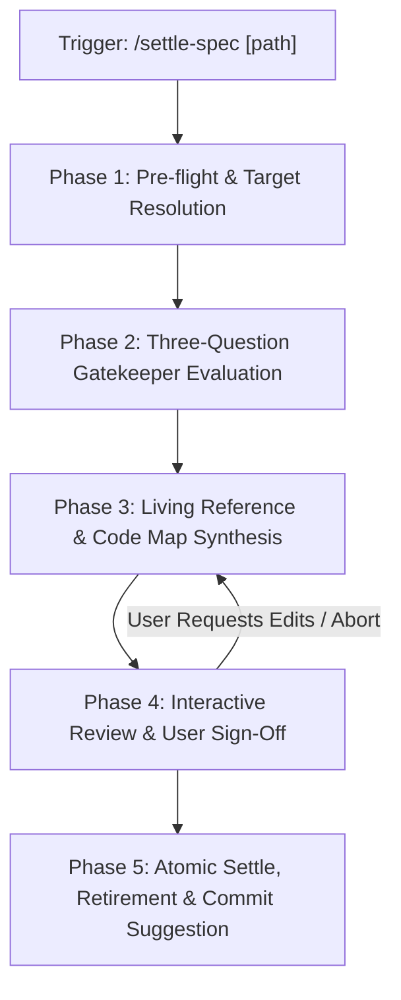

# Settle Specification Skill (`settle-spec`)

A portable, pure-cognitive workflow for AI coding agents and engineers to execute **Stage 3: Specification Settlement** of the Blueprint-Driven Development (BDD) lifecycle.

This skill formalizes the **Three-Question Settle Gatekeeper**, extracts enduring architectural invariants and state flows into `docs/reference/`, maintains canonical Code Navigation Maps, and safely retires verified progress specifications from `docs/progress/` without accumulating zombie WIP files or leaking ephemeral DTO duplicates.



---

## When to Run This Skill

Activate this skill when:
- An implementation slice or feature has completed Stage 2 (code implemented, tests passing, acceptance criteria verified).
- Ready to settle architectural trade-offs, state machines, or invariants into `docs/reference/[domain].md`.
- Retiring active progress specifications in `docs/progress/` while preventing "Knowledge Evaporation".
- Cleaning up completed WIP specifications to uphold the **Path-as-Status** standard.
- Updating living Code Navigation Maps to point to new canonical production files and test suites.

---

## System Invariants & Guardrails

> [!IMPORTANT]
> **Strict Governance Boundary**: The `settle-spec` skill operates exclusively on repository documentation artifacts (`docs/progress/` and `docs/reference/`). It **never** mutates, deletes, or modifies application source code, business data, or automated test files during settlement.

- **The Three-Question Settle Gatekeeper**:
  1. **Q1 (Architectural & State Flows)**: *Does this specification contain Mermaid sequence diagrams, state machine flows, or cross-system protocol transitions not immediately obvious from reading raw code?*
     - If **YES**: Extract and synthesize into `docs/reference/[domain].md`.
  2. **Q2 (Fault-Tolerance & Boundary Rules)**: *Does this specification define critical fault-tolerance, offline degradation, retry compensation, quarantine recovery, or domain boundary invariants?*
     - If **YES**: Extract and synthesize into `docs/reference/[domain].md`.
  3. **Q3 (Code-as-Truth & Self-Explanatory Logic)**: *Can a future engineer or AI agent understand this mechanism entirely from the production code and automated tests?*
     - If **YES**: **Discard ephemeral details**. Explicitly exclude standard API route tables, CRUD DTO field lists, and mock payloads. Production code is the single source of truth.
- **Interactive Human Confirmation**: Silent disk mutations are strictly prohibited. The proposed living reference changes and targeted file deletions must be previewed and confirmed by the user before applying changes.
- **Pure-Skill First (Zero-Runtime Dependency)**: Designed strictly as a Markdown cognitive workflow (`SKILL.md`), executable in any environment without requiring Node.js, Python, or auxiliary CLI binaries.
- **Unidirectional Code Maps**: Navigation pointers are maintained unilaterally in `docs/reference/[domain].md`. Implementation source code and skills remain clean, pure, and decoupled from internal documentation paths.
- **English-Only Maintenance**: All synthesized reference documents, section headers, code map pointers, and git commit messages must be authored and maintained exclusively in English.

---

## 5-Phase Cognitive Protocol

### Phase 1: Pre-flight Verification & Target Resolution

1. **Resolve Target Progress Specification**:
   - If a target path is passed (e.g., `/settle-spec docs/progress/1.1/3-feature-settle-spec-skill.md`), verify the file exists via `view_file` or `list_dir`.
   - If triggered without arguments (zero-argument mode):
     - Inspect `docs/progress/` for active markdown specifications (`*.md`), excluding `README.md`.
     - Present an enumerated list of candidate in-flight specifications and prompt the user to pick one.
2. **Verify Completion Proof**:
   - Inspect the specification's acceptance criteria and file mutation matrix.
   - Verify that corresponding production files and automated tests exist in the workspace.
   - Run a quick git status check (`git status --short`) to confirm there is no conflicting uncommitted scratch work in target areas.

### Phase 2: Three-Question Gatekeeper Evaluation

1. Inspect the target specification using bounded line-range reads.
2. Evaluate against the Three-Question Gatekeeper (see [settle-checklist.md](./references/settle-checklist.md)):
   - **Q1 Flow Extraction**: Itemize any Mermaid sequence diagrams, state machines, or protocol steps that capture non-obvious runtime behavior.
   - **Q2 Invariant Extraction**: Identify boundary rules, degradation policies, quarantine steps, or non-functional constraints.
   - **Q3 Ephemeral Elimination**: Filter out temporary checklists, implementation logs, request/response payload examples, and DTO field tables.
3. Map Target Domain Reference:
   - Identify the parent Blueprint code (e.g., `1.1` in `docs/progress/1.1/...`).
   - Locate the corresponding living reference file under `docs/reference/` (e.g., `docs/reference/workflow-governance.md`).
   - If no reference document exists for the domain, prepare to initialize one anchored to the upstream Blueprint.

### Phase 3: Living Reference & Code Map Synthesis

1. Read the target `docs/reference/[domain].md`.
2. Synthesize new content under standard living reference sections:
   - **System Invariants & Boundary Rules**: Add invariants extracted during Q2.
   - **State Machines & Critical Flows**: Insert sequence diagrams or state charts extracted during Q1.
   - **Code Navigation Map (Code Map)**: Register canonical paths to new production code, interfaces, configs, and automated test files (see [code-map-patterns.md](./references/code-map-patterns.md)).
3. Verify Code-as-Truth:
   - Confirm that zero duplicate DTO field lists, database column dictionaries, or API payload schemas are added to `docs/reference/`.

### Phase 4: Interactive Review & User Sign-Off

1. Present the **Settle Gatekeeper Review Card**:
   ```markdown
   ### 🧹 Settle Gatekeeper Report: `[target-spec-path]`

   #### 1. Three-Question Evaluation
   - [x] **Q1 (State Machines & Flows)**: [Summary of extracted diagrams/flows, or "None"]
   - [x] **Q2 (Fault-Tolerance & Invariants)**: [Summary of extracted rules/invariants, or "None"]
   - [ ] **Q3 (Self-Explanatory Logic)**: [Summary of discarded ephemeral DTOs/checklists]

   #### 2. Target Reference Updates
   - **Destination**: `docs/reference/[domain].md`
   - **Proposed Additions Preview**:
     ```markdown
     [Preview of synthesized sections]
     ```

   #### 3. Planned Cleanups
   - **Retire File**: `[target-spec-path]`
   - **Prune Directory**: `docs/progress/[slice]/` (if empty after retirement)

   👉 **Confirm Settlement?** [Proceed / Edit / Abort]
   ```
2. Await explicit human feedback or approval before making changes.

### Phase 5: Atomic Settle, Retirement & Commit Suggestion

1. Upon user approval:
   - Update `docs/reference/[domain].md` with the reviewed synthesis content.
   - Delete the retired progress specification file from `docs/progress/`.
   - Check if the parent slice directory in `docs/progress/` is empty (or contains only empty subdirectories). If empty, remove the directory.
2. Provide a standard Conventional Commit suggestion:
   ```bash
   git add docs/reference/ docs/progress/
   git commit -m "docs(workflow): settle [feature-name] into living reference"
   ```

---

## Detailed References

- [Three-Question Evaluation Checklist](./references/settle-checklist.md): Step-by-step triage guide for Q1, Q2, and Q3.
- [Code Map Design Patterns](./references/code-map-patterns.md): Rules for authoring and maintaining unidirectional Code Navigation Maps.
